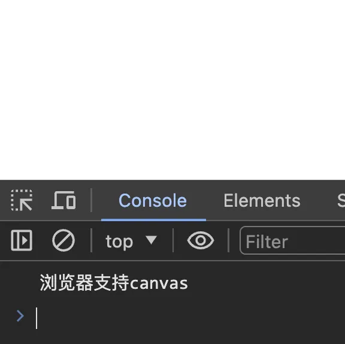

# [0002. 判断浏览器是否支持 canvas](https://github.com/Tdahuyou/TNotes.canvas/tree/main/notes/0002.%20%E5%88%A4%E6%96%AD%E6%B5%8F%E8%A7%88%E5%99%A8%E6%98%AF%E5%90%A6%E6%94%AF%E6%8C%81%20canvas)


<!-- region:toc -->

- [1. ⏰ TODO 待整理](#1--todo-待整理)

<!-- endregion:toc -->

## 1. ⏰ TODO 待整理

- 掌握判断浏览器是否支持 canvas 的两种方式。
[1.html](./1.html) 中的内容如下：
```html
<!DOCTYPE html>
<html lang="en">
  <head>
    <meta charset="UTF-8" />
    <meta name="viewport" content="width=device-width, initial-scale=1.0" />
    <title>Document</title>
  </head>
  <body>
    <!--
      绝大多数的浏览器都支持 canvas
      少数老版本的浏览器不支持（比如版本低于 9 的 IE 浏览器）
      可以通过下面这两种方式来判断浏览器是否支持 canvas：
      1. 浏览器如果不认识 canvas，会显示 canvas 标签中的内容。
      2. 通过检查 canvas 元素的 getContext 方法是否存在来检测浏览器是否支持 canvas。
     -->
    <canvas>
      您的浏览器版本过低，不支持canvas，请升级浏览器或更换浏览器
    </canvas>
    <script>
      // 通过 JS 来检查浏览器是否支持 canvas
      // 通过检查 canvas 元素的 getContext 方法是否存在来检测浏览器是否支持 canvas。
      function checkCanvasSupport() {
        var canvas = document.createElement('canvas') // 创建一个canvas元素
        return !!canvas.getContext // 检查getContext方法是否存在
      }
      if (checkCanvasSupport()) {
        console.log('浏览器支持canvas')
      } else {
        console.log('浏览器不支持canvas')
      }
    </script>
  </body>
</html>
```

因为浏览器支持 canvas，所以打开这个 1.html 之后，将看到一个空白的界面，并在 devtools 中的 console 模块中输出了 `浏览器支持canvas`。
