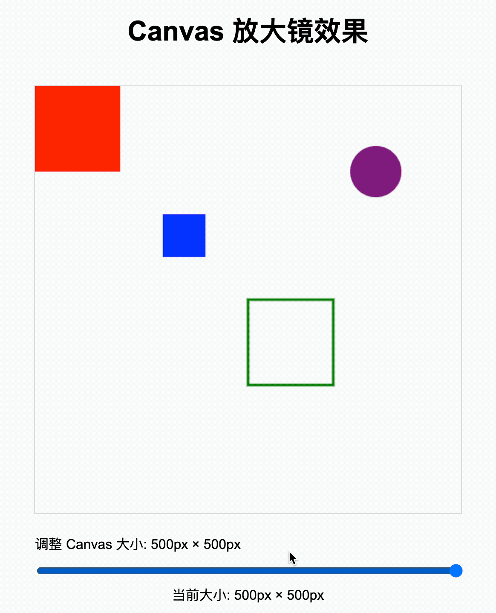

## 1. 目标

- 理解下面这两种设置画布尺寸做法的差异

```html
<!-- 【推荐】做法 1：直接通过 canvas 的 width、height 属性设置画布尺寸 -->
<canvas width="400" height="400"></canvas>
```

```html
<!-- 【不推荐】做法 2：通过 CSS 设置画布尺寸 -->
<style>
  #c1 {
    width: 400px;
    height: 400px;
  }
</style>

<canvas id="c1"></canvas>
```

## 2. 评价

- canvas 本身是一个元素、是一个盒模型，是一个容器，它也是有尺寸的。
- 我们知道，设置元素的尺寸可以直接通过 css 的 width、height 属性来实现，但是在 canvas 中，并不推荐使用 css 来设置 canvas 的宽高，而是直接使用 canvas 的 width、height 属性来设置画布的尺寸。
- 笔记中的大量篇幅在说明两种设置画布尺寸的做法之间的差异。其中，示例 `demos.2` 还利用了这一差异特性，实现了一个“放大镜”的小效果。

## 3. 为什么推荐直接通过 canvas 的 height、width 属性来设置画布尺寸而非通过 css 的 height、width 来设置呢？

- **style 设置的是容器的尺寸、canvas 的 width、height 设置的是画布坐标系的尺寸。如果两者的尺寸不一致，那么坐标系的最小单位将会自动缩小/放大，以适应容器尺寸。**
- 如果容器是 `400x400` 坐标系是 `200x200`，那么坐标系中的一个单位意味着 `2px`。（放大）
- 如果容器是 `400x400` 坐标系也是 `400x400`，那么坐标系中的一个单位意味着 `1px`。（正常）
- **因此，在设置画布尺寸的时候，为了防止坐标被拉伸，通常都是直接设置 canvas 的 width、height 而不是通过 style 来设置。**

## 4. demos.1 - 对比两种设置画布尺寸的写法

::: code-group

```html [1.html]
<!DOCTYPE html>
<html lang="en">
  <head>
    <meta charset="UTF-8" />
    <meta name="viewport" content="width=device-width, initial-scale=1.0" />
    <title>Document</title>
    <style>
      canvas {
        outline: 1px solid #ddd;
      }
      #c1 {
        width: 400px;
        height: 400px;
      }
      .box {
        width: 50px;
        height: 50px;
        background-color: black;
      }
    </style>
  </head>
  <body>
    <h1>50*50 盒子的大小（作为参照）</h1>
    <div class="box"></div>
    <!--
      1. canvas 可以使用 style 样式设置宽高
      2. canvas 也可以使用 width 和 height 属性设置宽高
      区别：
      1. style 的 width、height 设置的是画布容器尺寸
      2. canvas 的 width、height 设置的是画布坐标系
    -->
    <!--
    c1 容器的尺寸是 400 * 400
    c1 画布的坐标系是 200 * 200
    相当于 1 个单位是 2px
    意味着图像的大小被放大到原来的两倍
    -->
    <h1>c1 坐标系中的一个单位按比例放大两倍</h1>
    <canvas id="c1" width="200" height="200"></canvas>
    <!--
    c2 容器的尺寸是 400 * 400
    c2 画布的坐标系是 400 * 400
    相当于 1 个单位是 1px
     -->
    <h1>c2 坐标系比例保持不变</h1>
    <!--
    如果没有设置 style 的 width 和 height
    那么容器的尺寸就是 canvas 的 width、height 属性值
    也就是说 #c2 的容器尺寸就是 400 x 400
     -->
    <canvas id="c2" width="400" height="400"></canvas>
  </body>
  <script>
    {
      /**
       * @type {HTMLCanvasElement}
       */
      const canvas = document.querySelector('#c1')
      const ctx = canvas.getContext('2d')

      // 在 (0, 0) 位置绘制一个宽高为 50 的矩形
      ctx.fillRect(0, 0, 50, 50)
    }
    {
      /**
       * @type {HTMLCanvasElement}
       */
      const canvas = document.querySelector('#c2')
      const ctx = canvas.getContext('2d')
      ctx.fillRect(0, 0, 50, 50)
    }
  </script>
</html>
```

```html [2.html]
<!DOCTYPE html>
<html lang="en">
  <head>
    <meta charset="UTF-8" />
    <meta name="viewport" content="width=device-width, initial-scale=1.0" />
    <title>Document</title>
    <style>
      canvas {
        outline: 1px solid #ddd;
      }
      #c1 {
        width: 400px;
        height: 400px;
      }
      .box1 {
        width: 50px;
        height: 50px;
        background-color: black;
      }
      .box2 {
        width: 66px;
        height: 133px;
        background-color: black;
      }
    </style>
  </head>
  <body>
    <h1>50*50 盒子的大小（作为参照）</h1>
    <div class="box1"></div>
    <h1>66*133 盒子的大小（作为参照）</h1>
    <div class="box2"></div>

    <h1>c1 坐标系中的一个单位会按照默认的 canvas 尺寸被拉伸</h1>
    <canvas id="c1"></canvas>

    <h1>c2 坐标系比例保持不变</h1>
    <canvas id="c2" width="400" height="400"></canvas>
  </body>
  <script>
    {
      /**
       * @type {HTMLCanvasElement}
       */
      const canvas = document.querySelector('#c1')
      const ctx = canvas.getContext('2d')

      // 如果没有明确指定 canvas 元素的 width、height 属性值
      // 那么会使用默认值 300 x 150
      console.log(canvas.width) // 300
      console.log(canvas.height) // 150
      // 此时的单位像素会按照 (400/300, 400/150) 这个比例拉升
      // 相当于原来的 (50, 50) 的矩形会被拉升为 (50 * 400 / 300, 50 * 400 / 150)
      // 约等于 (66, 133)

      // 在 (0, 0) 位置绘制一个宽高为 50 的矩形
      ctx.fillRect(0, 0, 50, 50)
    }
    {
      /**
       * @type {HTMLCanvasElement}
       */
      const canvas = document.querySelector('#c2')
      const ctx = canvas.getContext('2d')
      ctx.fillRect(0, 0, 50, 50)
    }
  </script>
</html>
```

:::

- 1
  - 同时设置了 css 和 canvas 的 width、height
  - 
- 2
  - 只设置 css 的 width、height，忽略 canvas 的 width、height
  - 

## 5. demos.2 - 模拟放大镜的效果

::: code-group

```html [1.html]
<!DOCTYPE html>
<html lang="en">
  <head>
    <meta charset="UTF-8" />
    <meta name="viewport" content="width=device-width, initial-scale=1.0" />
    <title>Canvas 放大镜效果</title>
    <style>
      body {
        font-family: Arial, sans-serif;
        max-width: 800px;
        margin: 0 auto;
        padding: 20px;
      }
      .container {
        display: flex;
        flex-direction: column;
        align-items: center;
        gap: 20px;
      }
      #canvas-container {
        position: relative;
      }
      #c {
        width: 500px;
        height: 500px;
        border: 1px solid #ddd;
        transition: width 0.2s, height 0.2s;
      }
      .controls {
        width: 100%;
        max-width: 500px;
      }
      label {
        display: block;
        margin-bottom: 10px;
      }
      input[type='range'] {
        width: 100%;
      }
      .size-display {
        text-align: center;
        margin-top: 5px;
      }
    </style>
  </head>
  <body>
    <div class="container">
      <h1>Canvas 放大镜效果</h1>

      <div id="canvas-container">
        <canvas id="c" width="500" height="500"></canvas>
      </div>

      <div class="controls">
        <label for="size-slider">
          调整 Canvas 大小:
          <span id="size-value">500px × 500px</span>
        </label>
        <input
          type="range"
          id="size-slider"
          min="100"
          max="500"
          step="10"
          value="500"
        />
        <div class="size-display">
          当前大小:
          <span id="current-size">500px × 500px</span>
        </div>
      </div>
    </div>

    <script>
      const canvas = document.getElementById('c')
      const ctx = canvas.getContext('2d')
      const sizeSlider = document.getElementById('size-slider')
      const sizeValue = document.getElementById('size-value')
      const currentSizeDisplay = document.getElementById('current-size')

      // 绘制初始内容
      function drawContent() {
        // 清除画布
        ctx.clearRect(0, 0, canvas.width, canvas.height)

        // 绘制红色矩形
        ctx.fillStyle = 'red'
        ctx.fillRect(0, 0, 100, 100)

        // 绘制一些示例图形
        ctx.fillStyle = 'blue'
        ctx.fillRect(150, 150, 50, 50)

        ctx.strokeStyle = 'green'
        ctx.lineWidth = 3
        ctx.strokeRect(250, 250, 100, 100)

        ctx.fillStyle = 'purple'
        ctx.beginPath()
        ctx.arc(400, 100, 30, 0, Math.PI * 2)
        ctx.fill()
      }

      // 初始化绘制
      drawContent()

      // 滑块事件监听
      sizeSlider.addEventListener('input', function () {
        const newSize = this.value
        canvas.width = newSize
        canvas.height = newSize

        // 更新显示
        sizeValue.textContent = `${newSize}px × ${newSize}px`
        currentSizeDisplay.textContent = `${newSize}px × ${newSize}px`

        // 重新绘制内容
        drawContent()
      })

      // 添加鼠标滚轮控制
      canvas.addEventListener('wheel', function (e) {
        e.preventDefault()

        // 根据滚轮方向调整大小
        const delta = e.deltaY > 0 ? 20 : -20
        const newSize = Math.max(
          100,
          Math.min(500, parseInt(canvas.width) + delta)
        )

        // 更新滑块和画布
        sizeSlider.value = newSize
        canvas.width = newSize
        canvas.height = newSize

        // 更新显示
        sizeValue.textContent = `${newSize}px × ${newSize}px`
        currentSizeDisplay.textContent = `${newSize}px × ${newSize}px`

        // 重新绘制内容
        drawContent()
      })
    </script>
  </body>
</html>
```

:::

- 最终效果：
  - 
- 实现原理：
  - 保持容器尺寸 `css 设置的width、height` 不变，调整 canvas 自身的 width、height。
- 有很多待优化的点，比如：
  - 可以在 `drawContent` 中加入图形绘制起点的偏移量，根据鼠标在容器中的位置来设置缩放的焦点；
  - 也可以再加上鼠标按下和抬起的监听事件，当图像被放大之后，可以拖动图像；
  - ……
