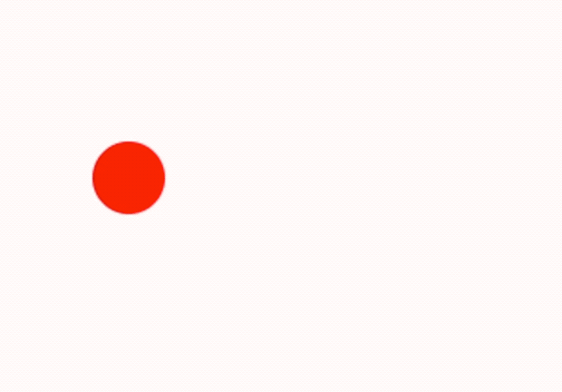

## 1. 目标

- 掌握 `ctx.clearRect` 的基本使用
- 了解 `ctx.clearRect` 的应用场景

## 2. 评价

- `ctx.clearRect` 是用来清除画布上指定的矩形区域的，有点儿类似画布上的橡皮擦。
- 需要理解擦除的本质是让指定的矩形区域变透明，并不是把指定区域中的线条（line）或者路径（path）给删除。
- 这个 API 常用来做动画效果，原理很简单 —— 不断地擦掉前一帧，然后绘制下一帧。比如，demos.2 不断运动的小球，就是这么绘制的。

## 3. `ctx.clearRect`

- **理解擦除的本质**
  - `ctx.clearRect(x, y, width, height)` 用于清除 canvas 上指定矩形区域的像素内容，使其变为完全透明。
  - 需要注意的是，Canvas 是在重置像素数据为透明，从而实现“擦除”的视觉效果。
- **应用场景**
  - 这个方法对于动画和游戏开发中的图形更新特别有用，它允许开发者清除旧的图像帧，从而在同一位置绘制新的帧。

| 应用场景 | 说明 |
| --- | --- |
| 动画 | 在每一帧动画开始时调用 `clearRect` 清除前一帧的像素内容，确保只显示当前帧的图形，实现平滑运动效果。 |
| 游戏开发 | 避免移动的图形（如角色、子弹）在移动过程中留下残留像素（拖影），通过清除背景区域或整个画布来实现动态更新。 |
| 用户界面 | 当 Canvas 渲染的 UI 元素（如按钮、进度条、图表）状态变化时，先清除旧内容区域，再绘制新状态，保证界面及时更新。 |

## 4. demos.1 - 掌握 `ctx.clearRect` 的基本使用

::: code-group

```html {16-32} [1.html]
<!DOCTYPE html>
<html lang="en">
  <head>
    <meta charset="UTF-8" />
    <meta name="viewport" content="width=device-width, initial-scale=1.0" />
    <title>📝 ctx.clearRect 方法</title>
  </head>
  <body>
    <script src="../common/drawGrid.js"></script>
    <script>
      const canvas = document.createElement('canvas')
      drawGrid(canvas, 500, 500, 50)
      document.body.appendChild(canvas)
      const ctx = canvas.getContext('2d')

      ctx.lineWidth = 10
      ctx.strokeStyle = 'red'

      // 使用 ctx.clearRect(x, y, width, height) 方法
      // 清除画布中的指定矩形区域

      // 【1】绘制一条横线
      ctx.beginPath()
      ctx.moveTo(0, 100)
      ctx.lineTo(400, 100)
      ctx.stroke()

      // 【2】绘制一条竖线
      ctx.beginPath()
      ctx.moveTo(100, 0)
      ctx.lineTo(100, 400)
      ctx.stroke()
    </script>
  </body>
</html>
```

```html {25} [2.html]
<!DOCTYPE html>
<html lang="en">
  <head>
    <meta charset="UTF-8" />
    <meta name="viewport" content="width=device-width, initial-scale=1.0" />
    <title>📝 ctx.clearRect 方法</title>
  </head>
  <body>
    <script src="../common/drawGrid.js"></script>
    <script>
      const canvas = document.createElement('canvas')
      drawGrid(canvas, 500, 500, 50)
      document.body.appendChild(canvas)
      const ctx = canvas.getContext('2d')

      ctx.lineWidth = 10
      ctx.strokeStyle = 'red'

      // 【1】绘制一条横线
      ctx.beginPath()
      ctx.moveTo(0, 100)
      ctx.lineTo(400, 100)
      ctx.stroke()

      ctx.clearRect(0, 0, 100, 400) // 【1】 的一部分会被擦掉。

      // 【2】绘制一条竖线
      ctx.beginPath()
      ctx.moveTo(100, 0)
      ctx.lineTo(100, 400)
      ctx.stroke()
    </script>
  </body>
</html>
```

```html {26} [3.html]
<!DOCTYPE html>
<html lang="en">
  <head>
    <meta charset="UTF-8" />
    <meta name="viewport" content="width=device-width, initial-scale=1.0" />
    <title>📝 ctx.clearRect 方法</title>
  </head>
  <body>
    <script src="../common/drawGrid.js"></script>

    <script>
      const canvas = document.createElement('canvas')
      drawGrid(canvas, 500, 500, 50)
      document.body.appendChild(canvas)
      const ctx = canvas.getContext('2d')

      ctx.lineWidth = 10
      ctx.strokeStyle = 'red'

      // 【1】绘制一条横线
      ctx.beginPath()
      ctx.moveTo(0, 100)
      ctx.lineTo(400, 100)
      ctx.stroke()

      ctx.clearRect(0, 0, canvas.width, canvas.height) // 擦除整个画布

      // 【2】绘制一条竖线
      ctx.beginPath()
      ctx.moveTo(100, 0)
      ctx.lineTo(100, 400)
      ctx.stroke()
    </script>
  </body>
</html>
```

```html {38} [4.html]
<!DOCTYPE html>
<html lang="en">
  <head>
    <meta charset="UTF-8" />
    <meta name="viewport" content="width=device-width, initial-scale=1.0" />
    <title>📝 ctx.clearRect 方法</title>
  </head>
  <body>
    <script src="../common/drawGrid.js"></script>

    <script>
      const canvas = document.createElement('canvas')
      drawGrid(canvas, 500, 500, 50)
      document.body.appendChild(canvas)
      const ctx = canvas.getContext('2d')

      ctx.lineWidth = 10
      ctx.strokeStyle = 'red'

      // 清除画布的本质就是将指定的矩形区域的透明度设置为 0
      // 之前的路径依然是存在的

      // 如果在开始绘制新的路径时不希望之前的路径出现
      // 别忘了调用 beginPath() 方法

      // 【1】绘制一条横线
      ctx.beginPath()
      // 假如将这个 beginPath 和下面的 beginPath 都注释掉的话，那么最后调用 stroke() 时，会将之前的网格路径也一起绘制出来。
      // 不过 lineWidth 和 strokeStyle 不再是 drawGrid 方法中封装的值了。

      ctx.moveTo(0, 100)
      ctx.lineTo(400, 100)
      ctx.stroke()

      ctx.clearRect(0, 0, canvas.width, canvas.height) // 擦除整个画布

      // 【2】绘制一条竖线
      // ctx.beginPath()
      // 如果没有这个 beginPath()，绘制【2】竖线的时候，之前的【1】横线也会出现。
      ctx.moveTo(100, 0)
      ctx.lineTo(100, 400)
      ctx.stroke() // 绘制路径，此时会同时绘制出【1】、【2】

      // 最终结果中会同时绘制出【1】横线、【2】竖线
      // 这是其实也就说明了使用 clearRect 来清除画布时
      // 实际上只是让画布上的图案变为透明了
      // 而非讲图案给清除掉
    </script>
  </body>
</html>
```

:::

::: swiper


:::

## 5. demos.2 - 运动的小球

::: code-group

```html {11-40} [1.html]
<!DOCTYPE html>
<html lang="en">
  <head>
    <meta charset="UTF-8" />
    <meta name="viewport" content="width=device-width, initial-scale=1.0" />
    <title>Document</title>
  </head>
  <body>
    <canvas id="canvas"></canvas>
    <script>
      /**
       * @type {HTMLCanvasElement}
       */
      const canvas = document.getElementById('canvas')
      const ctx = canvas.getContext('2d')

      let x = 0 // 小球的 x 坐标

      function animate() {
        // 1. 清除上一帧
        ctx.clearRect(0, 0, canvas.width, canvas.height)

        // 2. 更新状态
        x += 2
        if (x > canvas.width) {
          x = 0
        }

        // 3. 绘制新帧（画一个小球）
        ctx.beginPath()
        ctx.arc(x, 100, 20, 0, Math.PI * 2)
        ctx.fillStyle = 'red'
        ctx.fill()
        ctx.closePath()

        // 重复调用 animate 实现动画
        requestAnimationFrame(animate)
      }

      animate()
    </script>
  </body>
</html>
```

:::

- 
