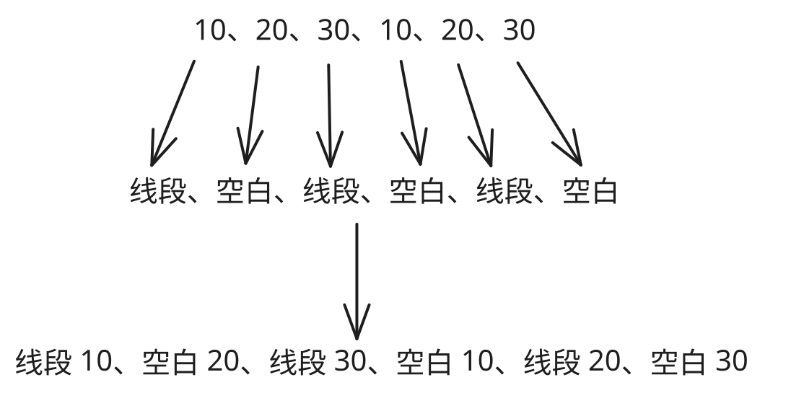

## 1. 目标

- 掌握 `ctx.setLineDash` 的基本使用

## 2. 评价

- `ctx.setLineDash` 使用的核心难点在于理解参数的多种形式，它可以接收任意长度的数字数组，非常灵活，这使得它能绘制出各种类型的虚线。
- 虽然参数可以是任意长度的数字数字，但是绘制虚线的规律其实非常简单，只需要弄清楚每一段线段和空白的长度是如何计算的即可。

## 3. `ctx.setLineDash`

- `ctx.setLineDash` 可以用来设置虚线，它会根据我们传入的参数数量不同，选择使用不同的行为来设置虚线之间的间隙。
- 不同的模式：
  - 传入一个数，比如 `[50]` 对应虚线：线段 50、空白 50、线段 50、空白 50 ……
  - 传入两个数，比如 `[50, 20]` 对应虚线：线段 50、空白 20、线段 50、空白 20 ……
  - 传入三个数，比如 `[10, 20, 30]` 对应虚线：线段 10、空白 20、线段 30、空白 10、线段 20、空白 30 ……
- 规律：
  - 1️⃣ 传入的数字无限重复
  - 2️⃣ 线段、空白无限重复
  - 1️⃣ ➕ 2️⃣ 合并就是最终绘制的虚线
- 示例：
  - 以 `[10, 20, 30]` 为例：
  - 1️⃣ 10、20、30、10、20、30
  - 2️⃣ 线段、空白、线段、空白、线段、空白
  - 

## 4. demos.1 - `ctx.setLineDash` 的基本使用

::: code-group

```html {16-46} [1.html]
<!DOCTYPE html>
<html lang="en">
  <head>
    <meta charset="UTF-8" />
    <meta name="viewport" content="width=device-width, initial-scale=1.0" />
    <title>Document</title>
  </head>
  <body>
    <script src="./drawGrid.js"></script>
    <script>
      const canvas = document.createElement('canvas')
      drawGrid(canvas, 500, 500, 50)
      document.body.appendChild(canvas)
      const ctx = canvas.getContext('2d')

      ctx.lineWidth = 10
      ctx.strokeStyle = 'red'

      // ctx.setLineDash(array) 方法，用于设置虚线。
      // 其中参数 array 中的数值含义：线段的长度、线段间空白的长度。

      ctx.beginPath()
      ctx.setLineDash([50])
      // 线段长度：50
      // 空白长度：50
      ctx.moveTo(50, 100)
      ctx.lineTo(450, 100)
      ctx.stroke()

      ctx.beginPath()
      ctx.setLineDash([50, 20])
      // 线段长度：50
      // 空白长度：20
      ctx.moveTo(50, 200)
      ctx.lineTo(450, 200)
      ctx.stroke()

      ctx.beginPath()
      ctx.setLineDash([10, 20, 30])
      // 按照数组的数列，无限的延续下去。
      // 【1】数字 10, 20, 30 无限重复     10       20      30        10       20       30        10       20  ...
      // 【2】线段、空白，无限重复          线段     空白     线段      空白      线段      空白      线段      空白  ...
      // 【1】+【2】匹配后的结果           线段10  空白20   线段30    空白10    线段20    空白30    线段10    空白20 ...
      ctx.moveTo(50, 300)
      ctx.lineTo(450, 300)
      ctx.stroke()
    </script>
  </body>
</html>
```

:::


