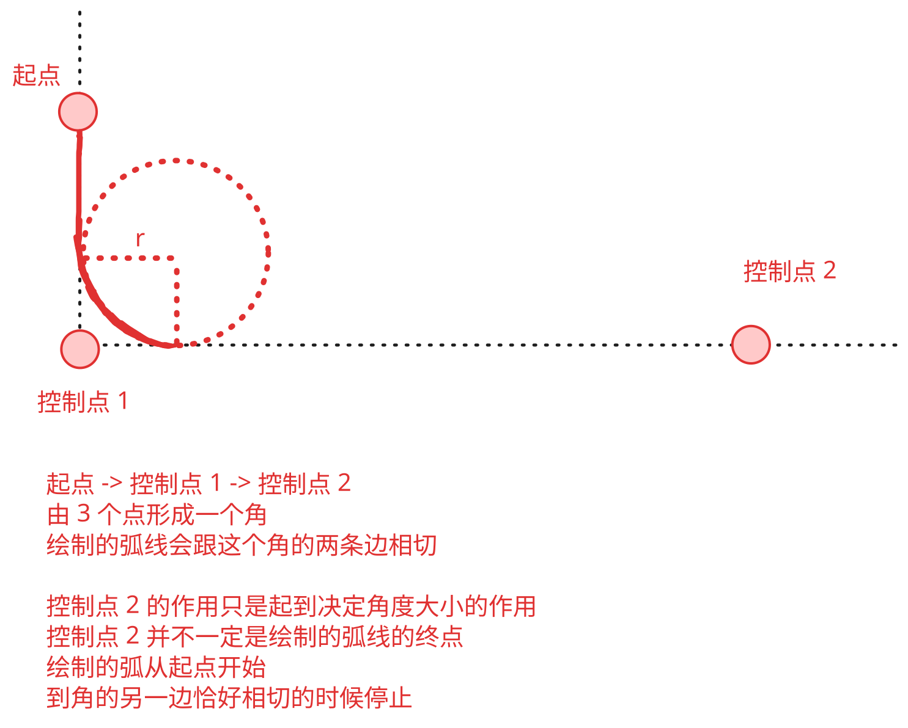

## 1. 目标

- 学会使用 `ctx.arcTo` 绘制圆弧。

## 2. 评价

- `ctx.arc` 和 `ctx.arcTo` 看似很像，实际上用起来差异还是蛮大的。
- 对于 `ctx.arcTo` 绘制的圆弧，它是通过 3 个控制点 + 1 个半径来绘制的。
- 需要注意的是，绘制的弧会从起点开始，但不一定在最后一个控制点结束。

## 3. `ctx.arcTo`

- 看一张图就明白了。
- 

## 4. demos.1 - 使用 `ctx.arcTo` 绘制圆弧

::: code-group

```html {17-25,28-52} [1.html]
<!DOCTYPE html>
<html lang="en">
  <head>
    <meta charset="UTF-8" />
    <meta name="viewport" content="width=device-width, initial-scale=1.0" />
    <title>📝 arcTo 方法</title>
  </head>
  <body>
    <script src="../common/drawGrid.js"></script>
    <script>
      const canvas = document.createElement('canvas')
      drawGrid(canvas, 500, 500, 50)
      document.body.appendChild(canvas)
      const ctx = canvas.getContext('2d')

      // #region 辅助线
      ctx.beginPath()
      ctx.moveTo(100, 100)
      ctx.lineTo(100, 300)
      ctx.lineTo(300, 300)
      ctx.stroke()

      ctx.beginPath()
      ctx.arc(200, 200, 100, 0, Math.PI * 2)
      ctx.stroke()
      // #endregion 辅助线

      // context.arcTo(x1, y1, x2, y2, radius)
      // 用于绘制圆角路径。
      // 常用于绘制具有特定半径的圆角。

      // 第 1 个点：moveTo 指定的点或者上一次图形路径结束的点
      // 第 2 个点：(x1, y1)
      // 第 3 个点：(x2, y2)
      // 由 3 个控制点实现圆弧的绘制。
      // 按照 3 个点的位置，连线，形成一个夹角。
      // 绘制的圆弧，与夹角的两条边相切。
      // 根据指定的半径的不同，绘制出来的圆弧也不同。

      // radius 指定了圆角的大小，即圆弧的半径。
      // 根据 r 绘制圆弧，保证与两个线条相切。
      // 注意：如果 radius 值过大，无法基于提供的点和半径绘制圆角，那么浏览器将不绘制圆弧。

      ctx.beginPath()
      ctx.lineWidth = 10
      ctx.strokeStyle = 'red'
      ctx.moveTo(100, 200) // 起点
      ctx.arcTo(100, 300, 200, 300, 100)
      // 100 300 表示第 1 个控制点
      // 200 300 表示第 2 个控制点
      // 100 表示圆角的半径
      ctx.stroke()
    </script>
  </body>
</html>
```

```html {17-25,28-42} [2.html]
<!DOCTYPE html>
<html lang="en">
  <head>
    <meta charset="UTF-8" />
    <meta name="viewport" content="width=device-width, initial-scale=1.0" />
    <title>📝 arcTo 方法</title>
  </head>
  <body>
    <script src="../common/drawGrid.js"></script>
    <script>
      const canvas = document.createElement('canvas')
      drawGrid(canvas, 500, 500, 50)
      document.body.appendChild(canvas)
      const ctx = canvas.getContext('2d')

      // #region 辅助线
      ctx.beginPath()
      ctx.moveTo(100, 100)
      ctx.lineTo(100, 300)
      ctx.lineTo(300, 300)
      ctx.stroke()

      ctx.beginPath()
      ctx.arc(200, 200, 100, 0, Math.PI * 2)
      ctx.stroke()
      // #endregion 辅助线

      ctx.beginPath()
      ctx.lineWidth = 10
      ctx.strokeStyle = 'red'
      ctx.moveTo(100, 100) // 起点坐标
      ctx.arcTo(100, 300, 300, 300, 50) // 写法 1
      // 100 300 表示第 1 个控制点
      // 300 300 表示第 2 个控制点
      // 50 表示圆角的半径
      // 注意：ctx.arcTo 这玩意儿绘制的是圆弧
      // 所以最终结束位置是在圆弧的终点，而非控制点 2 所在的位置。
      // 把控制点 2 的坐标由 300 300 改成 101 300 最终绘制的效果也是一样的。
      // ctx.arcTo(100, 300, 101, 300, 50) // 写法 2
      ctx.stroke()

      // 写法 1、2 的控制点 2 的坐标不同，但是最终绘制出来的图形是一样的。
    </script>
  </body>
</html>
```

:::

- 最终效果：

::: swiper


:::

- **注意：**
  - 传入的控制点 2 的坐标，并不代表终点的位置，而仅仅是起到决定圆弧弧度的作用，这一点可以从 `2.html` 看出。
