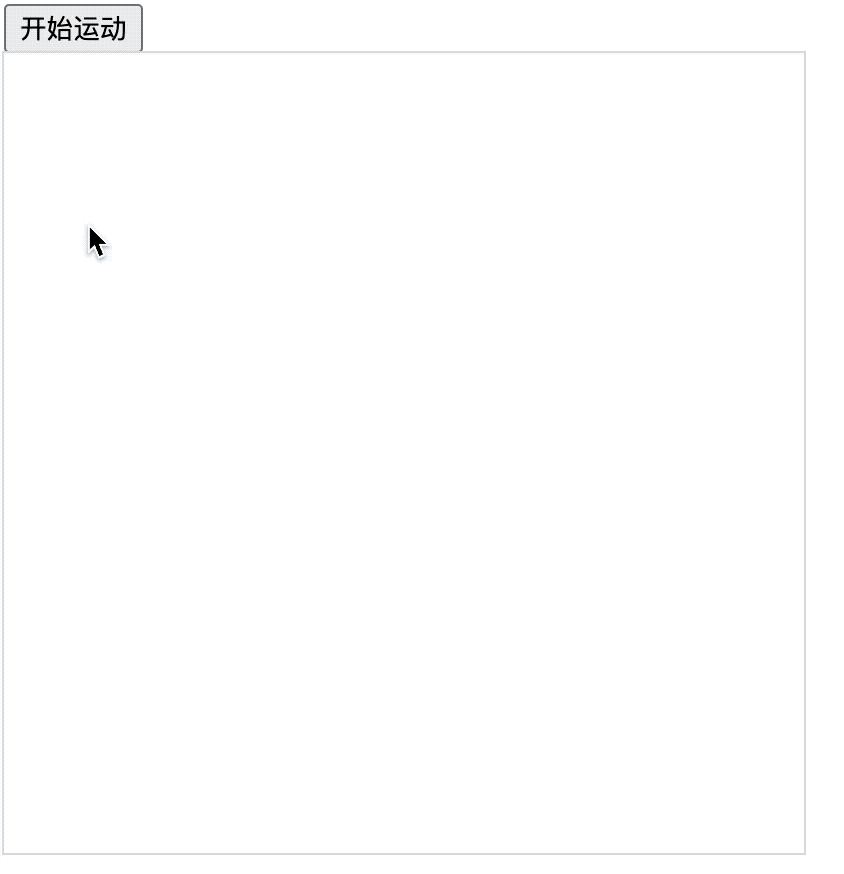

## 1. 评价

- 🎯 目标
  - 读懂 demo
- 🫧 评价
  - `lineDashOffset` 设置虚线的位移，不仅可以作用于直线上，也可以在折线、曲线上。
  - 如果你想要让线条沿着绘制的路线动起来，都可以尝试下 `lineDashOffset`。

## 2. demos.1 - 矩形轮廓旋转动画

::: code-group

```html {18-43} [1.html]
<!DOCTYPE html>
<html lang="en">
  <head>
    <meta charset="UTF-8" />
    <meta name="viewport" content="width=device-width, initial-scale=1.0" />
    <title>📝 矩形边框旋转动画</title>
    <style>
      canvas {
        outline: 1px solid #ddd;
      }
    </style>
  </head>
  <body>
    <div>
      <button id="start-move">开始运动</button>
    </div>
    <script>
      const canvas = document.createElement('canvas')
      canvas.width = 400
      canvas.height = 400
      document.body.append(canvas)

      const ctx = canvas.getContext('2d')

      ctx.lineWidth = 5
      ctx.strokeStyle = 'blue'
      ctx.setLineDash([10])

      function move() {
        ctx.clearRect(0, 0, 400, 400)
        ctx.beginPath()

        ctx.lineDashOffset -= 1
        // 正负：大于 0 逆时针，小于 0 顺时针
        // 绝对值：越大旋转速度越快

        ctx.rect(100, 100, 200, 200)
        ctx.stroke()

        requestAnimationFrame(move)
      }
      const startMove = document.getElementById('start-move')
      startMove.addEventListener('click', move)
    </script>
  </body>
</html>
```

:::

- 原理：
  - 通过不断设置虚线的位移 `lineDashOffset` 来实现的动画效果。
- 最终效果：
  - 
