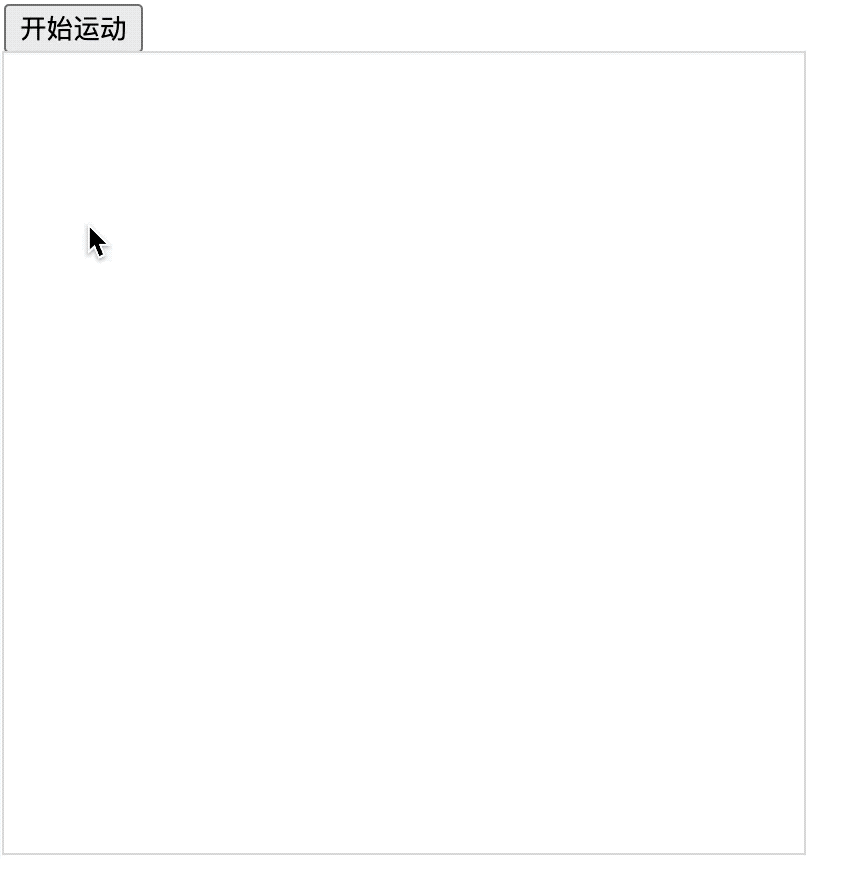

# [0028. 矩形边框旋转动画](https://github.com/Tdahuyou/TNotes.template/tree/main/notes/0028.%20%E7%9F%A9%E5%BD%A2%E8%BE%B9%E6%A1%86%E6%97%8B%E8%BD%AC%E5%8A%A8%E7%94%BB)


<!-- region:toc -->
- [1. 📒 notes](#1--notes)
- [2. 💻 demo1](#2--demo1)
<!-- endregion:toc -->

## 1. 📒 notes

当你想要让线条沿着绘制的路径动起来的时候，都可以尝试下 `lineDashOffset`。

**原理：** 通过不断设置虚线的位移 `lineDashOffset` 来实现的动画效果。

`lineDashOffset` 虚线的位移不仅作用于直线上边，在矩形轮廓，弧形轮廓，圆形轮廓上都能够起作用。当你想要让线条沿着绘制的路径动起来的时候，都可以尝试下 `lineDashOffset`。

## 2. 💻 demo1

```html
<!-- 1.html -->
<!DOCTYPE html>
<html lang="en">
  <head>
    <meta charset="UTF-8" />
    <meta name="viewport" content="width=device-width, initial-scale=1.0" />
    <title>📝 矩形边框旋转动画</title>
    <style>
      canvas {
        outline: 1px solid #ddd;
      }
    </style>
  </head>
  <body>
    <div>
      <button id="start-move">开始运动</button>
    </div>
    <script>
      const canvas = document.createElement('canvas')
      canvas.width = 400
      canvas.height = 400
      document.body.append(canvas)

      const ctx = canvas.getContext('2d')

      ctx.lineWidth = 5
      ctx.strokeStyle = 'blue'
      ctx.setLineDash([10])

      function move() {
        ctx.clearRect(0, 0, 400, 400)
        ctx.beginPath()

        ctx.lineDashOffset -= 1
        // 正负：大于 0 逆时针，小于 0 顺时针
        // 绝对值：越大旋转速度越快

        ctx.rect(100, 100, 200, 200)
        ctx.stroke()

        requestAnimationFrame(move)
      }
      const startMove = document.getElementById('start-move')
      startMove.addEventListener('click', move)
    </script>
  </body>
</html>
```


