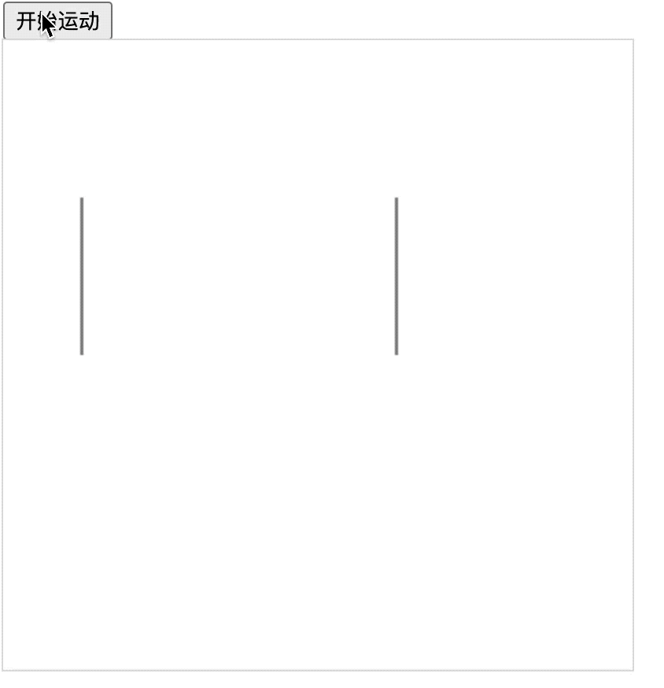

## 1. 评价

- 🎯 目标
  - 学会使用 `lineDashOffset` 来设置线条的动画效果，理解动画的实现原理。
- 🫧 评价
  - “线条穿梭动画”的效果，也是通过不断设置虚线的位移 `lineDashOffset` 来实现的动画效果。

## 2. demos.1 - 线条穿梭动画

::: code-group

```html {37-57} [1.html]
<!DOCTYPE html>
<html lang="en">
  <head>
    <meta charset="UTF-8" />
    <meta name="viewport" content="width=device-width, initial-scale=1.0" />
    <title>📝 线条穿梭动画</title>
    <style>
      canvas {
        outline: 1px solid #ddd;
      }
    </style>
  </head>
  <body>
    <div>
      <button id="start-move">开始运动</button>
    </div>
    <script>
      const canvas = document.createElement('canvas')
      canvas.width = 400
      canvas.height = 400
      document.body.append(canvas)

      const ctx = canvas.getContext('2d')

      // 开始位置的竖线
      ctx.beginPath()
      ctx.moveTo(50, 100)
      ctx.lineTo(50, 200)
      ctx.stroke()

      // 结束位置的竖线
      ctx.beginPath()
      ctx.moveTo(250, 100)
      ctx.lineTo(250, 200)
      ctx.stroke()

      ctx.lineWidth = 10
      ctx.strokeStyle = 'red'
      ctx.setLineDash([200]) // 设置虚线间隙 200
      ctx.lineDashOffset = 200 // 设置线条偏移量为 200

      function move() {
        ctx.clearRect(50, 145, 200, 10) // 将线条运动过的路径给清空
        ctx.beginPath()
        ctx.lineDashOffset -= 2 // 调节运动速度
        ctx.moveTo(50, 150)
        ctx.lineTo(250, 150) // 线段的长度是 250 - 50 = 200
        ctx.stroke()

        if (ctx.lineDashOffset == -200) {
          // 200 偏移量作为临界值
          ctx.lineDashOffset = 200
        }
        requestAnimationFrame(move)
      }
      const startMove = document.getElementById('start-move')
      startMove.addEventListener('click', move)
    </script>
  </body>
</html>
```

:::

- 小技巧：将虚线的间隙长度和线条偏移量的长度设置为相同的值，正好就是开始位置到结束位置的距离。
- 最终效果：
  - 
