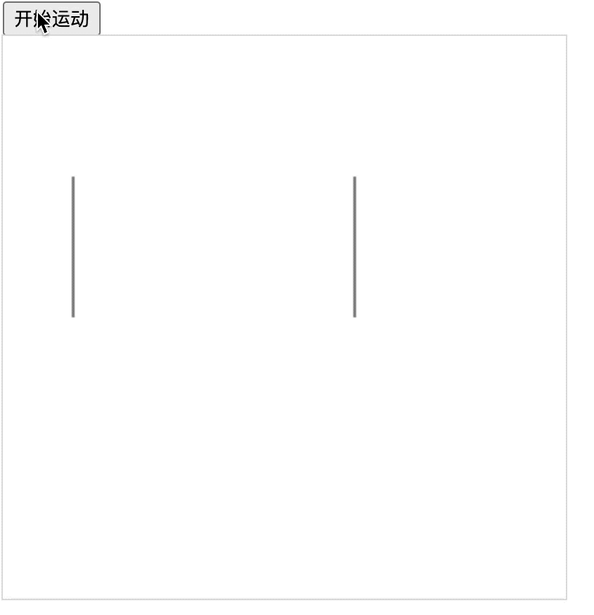

# [0029. 线条穿梭动画](https://github.com/Tdahuyou/TNotes.canvas/tree/main/notes/0029.%20%E7%BA%BF%E6%9D%A1%E7%A9%BF%E6%A2%AD%E5%8A%A8%E7%94%BB)

<!-- region:toc -->

- [1. 📝 概述](#1--概述)
- [2. 💻 demo1](#2--demo1)

<!-- endregion:toc -->

## 1. 📝 概述

- 🎯 目标
  - 学会使用 `lineDashOffset` 来设置线条的动画效果，理解动画的实现原理。
- 🫧 评价
  - “线条穿梭动画”的效果，也是通过不断设置虚线的位移 `lineDashOffset` 来实现的动画效果。

## 2. 💻 demo1

::: code-group

<<< ./demos/1/1.html {37-57}

:::

- 小技巧：将虚线的间隙长度和线条偏移量的长度设置为相同的值，正好就是开始位置到结束位置的距离。
- 最终效果：
  - 
