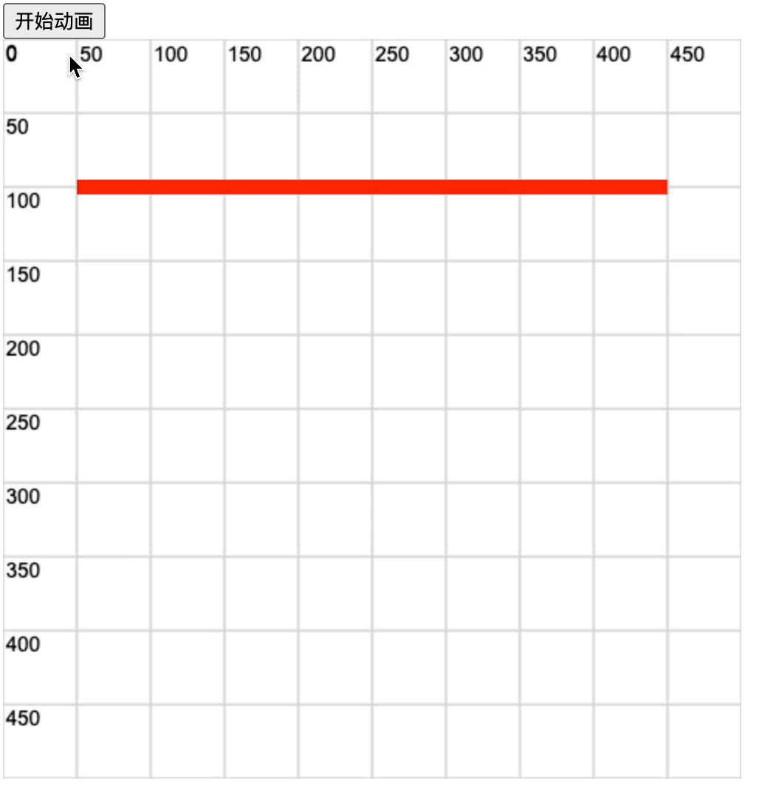

## 1. 评价

- 🎯 目标
  - 学会使用 `lineDashOffset` 来设置线条的动画效果。
- 🫧 评价
  - 如果线条每次偏移（即，改变 `ctx.lineDashOffset`）的时候，没有清空画布的话，那么线条之前的运动轨迹将保留在界面上。此时看起来就有些类似于进度条加载的效果。

## 2. demos.1 - 模拟进度条效果

::: code-group

```html {29-52} [1.html]
<!DOCTYPE html>
<html lang="en">
  <head>
    <meta charset="UTF-8" />
    <meta name="viewport" content="width=device-width, initial-scale=1.0" />
    <title>Document</title>
  </head>
  <body>
    <div>
      <button id="start-move">开始动画</button>
    </div>

    <script src="../common/drawGrid.js"></script>
    <script>
      const canvas = document.createElement('canvas')
      drawGrid(canvas, 500, 500, 50)
      document.body.appendChild(canvas)
      const ctx = canvas.getContext('2d')

      ctx.lineWidth = 10
      ctx.strokeStyle = 'red'

      // 位于上方的参考线
      ctx.beginPath()
      ctx.moveTo(50, 100)
      ctx.lineTo(450, 100)
      ctx.stroke()

      // 用于模拟进度条的线
      ctx.beginPath()
      // 为了方便控制，将下面这 3 个核心属性的值设为相同值，保持长度统一。
      // 设置虚线间隔为 400px
      ctx.setLineDash([400])
      // 设置偏移量也为 400px
      ctx.lineDashOffset = 400
      // 绘制的线段长度也为 400px
      ctx.moveTo(50, 200)
      ctx.lineTo(450, 200)
      ctx.stroke()

      function move() {
        ctx.lineDashOffset--
        // console.log('ctx.lineDashOffset', ctx.lineDashOffset) // 从 400 变到 0
        // 通过不断改变 lineDashOffset 的值，实现动画效果。
        ctx.stroke()

        if (ctx.lineDashOffset > 0) {
          requestAnimationFrame(move)
        }
      }
      const startMoveBtn = document.getElementById('start-move')
      startMoveBtn.addEventListener('click', move)
    </script>
  </body>
</html>
```

:::

- 点击【开始运动】按钮后，进度条会从起点加载到终点。
  - 
- 最终效果如下图所示。
  - 
