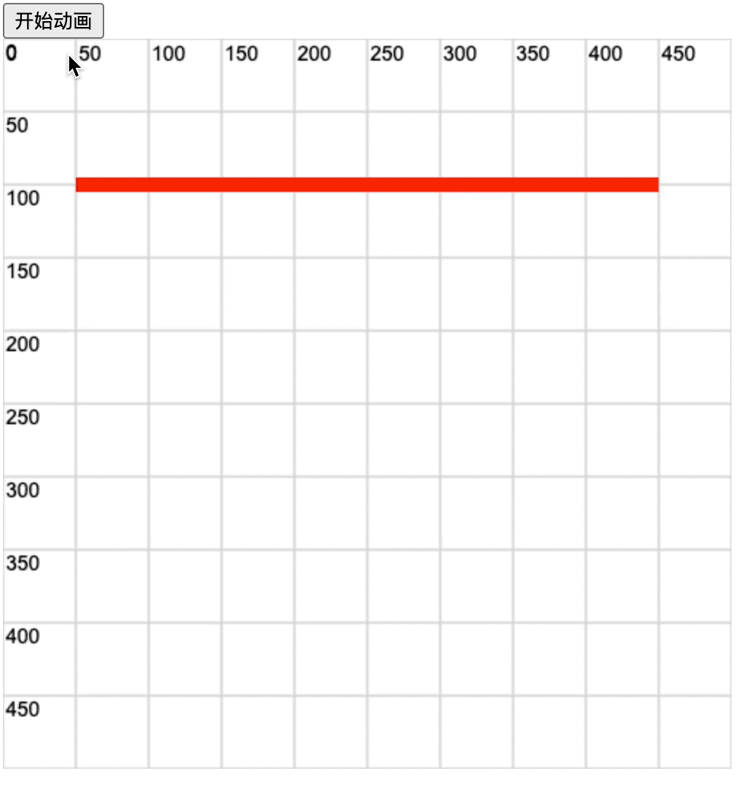

# [0030. 模拟进度条动画效果](https://github.com/Tdahuyou/TNotes.canvas/tree/main/notes/0030.%20%E6%A8%A1%E6%8B%9F%E8%BF%9B%E5%BA%A6%E6%9D%A1%E5%8A%A8%E7%94%BB%E6%95%88%E6%9E%9C)

<!-- region:toc -->

- [1. 🫧 评价](#1--评价)
- [2. 💻 demos.1 - 模拟进度条效果](#2--demos1---模拟进度条效果)

<!-- endregion:toc -->

## 1. 🫧 评价

- 🎯 目标
  - 学会使用 `lineDashOffset` 来设置线条的动画效果。
- 🫧 评价
  - 如果线条每次偏移（即，改变 `ctx.lineDashOffset`）的时候，没有清空画布的话，那么线条之前的运动轨迹将保留在界面上。此时看起来就有些类似于进度条加载的效果。

## 2. 💻 demos.1 - 模拟进度条效果

::: code-group

<<< ./demos/1/1.html {29-52}

:::

- 点击【开始运动】按钮后，进度条会从起点加载到终点。
  - 
- 最终效果如下图所示。
  - 
