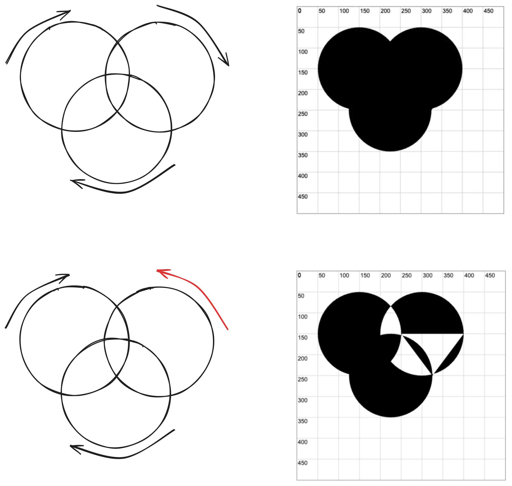

# [0031. ctx.clip](https://github.com/Tdahuyou/TNotes.canvas/tree/main/notes/0031.%20ctx.clip)

<!-- region:toc -->

- [1. 🎯 目标](#1--目标)
- [2. 🫧 评价](#2--评价)
- [3. 📒 `ctx.clip` 简介](#3--ctxclip-简介)
- [4. 📒 `fillRule` 填充规则 - `nonzero` 和 `evenodd`](#4--fillrule-填充规则---nonzero-和-evenodd)
  - [4.1. `nonzero` 非零填充规则](#41-nonzero-非零填充规则)
  - [4.2. evenodd 奇偶填充规则](#42-evenodd-奇偶填充规则)
  - [4.3. 小结](#43-小结)
- [5. 💻 demos.3 - 理解 fillRule](#5--demos3---理解-fillrule)
- [6. 💻 demos.1 - 裁剪菱形](#6--demos1---裁剪菱形)
- [7. 💻 demos.2 - 裁剪圆形](#7--demos2---裁剪圆形)
- [8. 💻 demos.4 - 问题记录](#8--demos4---问题记录)
- [9. 🔗 References](#9--references)

<!-- endregion:toc -->

## 1. 🎯 目标

- 掌握 `ctx.clip` 的基本使用
- 理解 `fillRule` 填充规则 - `nonzero` 和 `evenodd`

## 2. 🫧 评价

- ctx.clip 的基本使用是比较简单的，但是填充规则不太好理解，并且暂时也还不清楚填充规则有何实际的应用场景……
- 对于填充规则的介绍，笔记中的大量内容引用了[“张鑫旭”老师的博客文章 —— 搞懂 SVG/Canvas 中 nonzero 和 evenodd 填充规则][1]。
- nonzero 和 evenodd 填充规则在 TNotes.svg 知识库中也有提及，直接搜关键字应该就能找到对应的笔记。
- 在阅读“`fillRule` 填充规则 - `nonzero` 和 `evenodd`”的时候，可以结合着 `demos.3` 一起看。
- ⏰ TODO：
  - demos.4 没看懂最终的渲染结果……

## 3. 📒 `ctx.clip` 简介

- `ctx.clip` 用来裁剪图像，基本语法如下：

```js
clip()
clip(path)
clip(fillRule)
clip(path, fillRule)
```

- 难点在于理解填充规则 `fillRule`
  - `nonzero` 非零填充规则
  - `evenodd` 奇偶填充规则

## 4. 📒 `fillRule` 填充规则 - `nonzero` 和 `evenodd`

- 通用知识点
  - 只要是路径填充，都有两种规则，nonzero 和 evenodd。无论是 SVG 中的路径填充，还是 Canvas 中的路径填充，如果还有其他和路径相关的技术（甚至设计软件），也离不开这两种填充规则。换句话说，**这是超越各种语言，普世通用的知识点**。
- 示例 1
  - 如果我们用 3 个点，连成一个三角形，则这两种填充规则没什么区别。

| nonzero（默认） | evenodd |
| :-: | :-: |
|  |  |

- 示例 2
  - 如果是两个三角形，并且发生重叠，差异就出现了。
  - 你会发现在 `evenodd` 奇偶填充规则下，中间的重叠部分是镂空的，并没有被填充。
  - 为了方便讲解，我们可以把示例中的三角路径方向和序号标记一下。

| nonzero（默认） | evenodd |
| :-: | :-: |
|  |  |

- 接下来需要思考以下问题：
  - **🤔 为什么在默认的 nonzero 非零填充规则下，重叠部分被填充了？在 evenodd 奇偶填充规则下，重叠部分没有填充呢？**
    - 填充规则的关键，就是确定复杂路径构成的图形，哪些是内部，哪些是外部。内部则填充，外部则不填充。这就是说重叠区域被 nonzero 判定为内部区域，但是被 evenodd 判定为外部区域。
  - **🤔 为什么“重叠区域被 nonzero 判定为内部区域，但是被 evenodd 判定为外部区域”？**
    - “nonzero 规则”顾名思意就是“非零规则”，用通俗的话讲，就算 `x` 是不是 `0`，如果不是 `0` 则内部，填充；如果是 `0` 则外部，不填充。
    - “evenodd 规则”顾名思意就是“奇偶规则”，用通俗的话讲，就算 `x` 是不是奇数，如果是是奇数则内部，填充；如果是偶数则外部，不填充。
  - **🤔 `x` 是什么？**
    - 首先需要注意，nonzero 规则和 evenodd 规则中的 `x` 指的不是一个东西。
    - 要判断某一个区域是路径内还是路径外，很简单，在这个区域内任意找一个点，然后以这个点为起点，发射一条无限长的射线，然后再根据具体的规则要求来计算 `x` 的值，以此来判断这个区域被判定为“内部”还是“外部”。
    - 在 nonzero 非零填充规则下：
      - $顺时针 = 1$
      - $逆时针 = -1$
      - $x = 顺时针数量 + 逆时针数量$
    - 在 evenodd 奇偶填充规则下：
      - $x = 交叉路径数量$
    - 补充：若不清除这里提到的“顺时针”、“逆时针”、“交叉路径”分别是什么，可见下文说明……

### 4.1. `nonzero` 非零填充规则

- 起始值为 0，射线会和路径相交，如果路径方向和射线方向形成的是顺时针方向则+1，如果是逆时针方向则-1，最后如果数值为 0，则是路径的外部；如果不是 0，则是路径的内部，因此被称为“非 0 填充规则”。
- 示例 1
  - 
  - 例如上图点 A，我们随便发出一条射线，结果经过了路径 5 和路径 2，我们顺着路径前进方向和射线前进方向，可以看到，合并后的运动方向都是逆时针，逆时针方向-1，因此，最后计算值是-2，不是 0，因此，是内部，fill 时候可以被填充。
- 示例 2
  - 
  - 点 B 再发出一条射线，经过两条路径片段，为路径 2 和路径 3，我们顺着路径前进方向和射线前进方向，可以看到，合并后的运动方向一个是逆时针，-1，一个是顺时针，+1，因此，最后的计算值是 0，是外部，因此，不被填充。

### 4.2. evenodd 奇偶填充规则

- 起始值为 0，射线会和路径相交，每交叉一条路径，我们计数就+1，最后看我们的总计算数值，如果是奇数，则认为是路径内部，如果是偶数，则认为是路径外部。
- 示例 1
  - 
  - 例如上图点 A，我们随便发出一条射线，结果经过了路径 5 和路径 2，交叉的路径个数为 2，是偶数，因此，属于路径外，不填充。
- 示例 2
  - 
  - 点 B 再发出一条射线，经过路径片段路径 2 和路径 3，交叉的路径个数为 2，是偶数，因此，也属于路径外，不填充。
- 示例 3
  - 
  - 最后这个点 C，发出的射线总共和 3 个路径交叉，是奇数。因此，属于路径内，填充。

### 4.3. 小结

- nonzero
  - 从区域内任意点引一条射线，统计路径 **环绕方向** 的“代数和”：
    - 每当路径从 **左到右** 穿过射线（即顺时针方向），计数 -1；
    - 每当路径从 **右到左** 穿过射线（即逆时针方向），计数 +1；
    - 如果总和（环绕数）**不为零**，则该点在“内部”，填充。
  - 路径的 **方向（顺时针或逆时针）** 非常重要。
- evenodd
  - 从区域内任意一个点向任意方向画一条射线，统计这条射线与路径边界的 **交点数量**：
    - 如果交点数是 **奇数**，则该点在“内部”，会被填充；
    - 如果是 **偶数**，则在“外部”，不填充。
  - 简单直观，不关心路径方向（顺时针/逆时针），常用于处理嵌套图形或自相交图形。

| 特性             | `evenodd`                      | `nonzero`              |
| ---------------- | ------------------------------ | ---------------------- |
| 是否依赖路径方向 | ❌ 否                          | ✅ 是                  |
| 判断依据         | 交点数量的奇偶性               | 环绕数的代数和         |
| 处理嵌套图形     | 自动挖空（内外层都填充奇数次） | 可通过方向控制是否填充 |

## 5. 💻 demos.3 - 理解 fillRule

::: code-group

<<< ./demos/3/1.html {37,63}

:::

- 

## 6. 💻 demos.1 - 裁剪菱形

::: code-group

<<< ./demos/1/1.html {31-33,43-55}

:::

- 

## 7. 💻 demos.2 - 裁剪圆形

::: code-group

<<< ./demos/2/1.html {24-28,38-46}

:::

- 

## 8. 💻 demos.4 - 问题记录

::: code-group

<<< ./demos/4/1.html {}

:::

- 不理解 3、4 的最终渲染结果。
- 
- 

## 9. 🔗 References

- https://www.zhangxinxu.com/wordpress/2018/10/nonzero-evenodd-fill-mode-rule/
  - 搞懂 SVG/Canvas 中 nonzero 和 evenodd 填充规则 « 张鑫旭-鑫空间-鑫生活。
- https://developer.mozilla.org/zh-CN/docs/Web/API/CanvasRenderingContext2D/clip
  - MDN - CanvasRenderingContext2D：clip() 方法
- https://en.wikipedia.org/wiki/Even%E2%80%93odd_rule
  - Wiki - Even–odd rule
- https://en.wikipedia.org/wiki/Nonzero-rule
  - Wiki - Nonzero-rule

[1]: https://www.zhangxinxu.com/wordpress/2018/10/nonzero-evenodd-fill-mode-rule/
