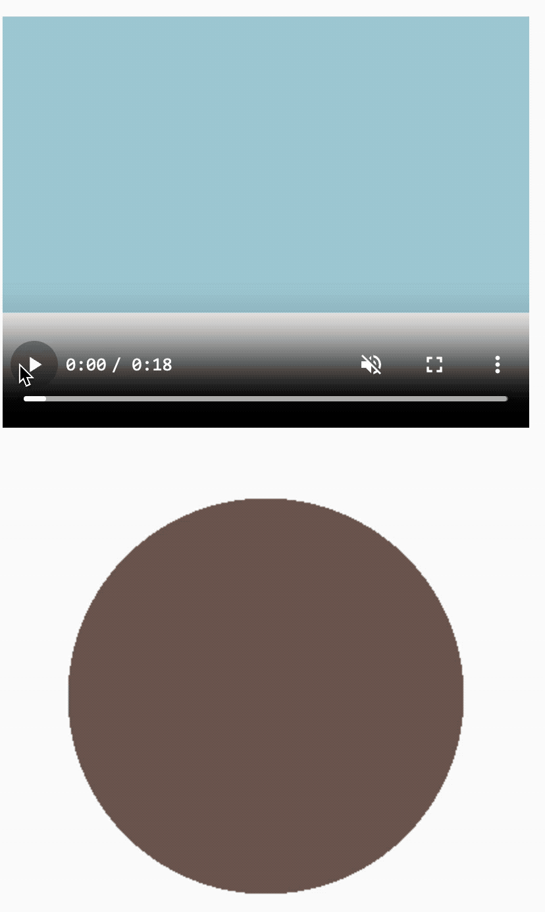

## 1. 目标

- 掌握 `ctx.drawImage` 的基本使用
- 通过 `demos.1` 了解 `ctx.drawImage` 的一些特殊用法 - 比如视频图像处理
- 通过 `demos.2` 能够理解人物的运动原理 - 本质上使用的是 `ctx.drawImage` 的“截图”功能

## 2. 评价

- 视频处理
  - 可以使用 `ctx.drawImage` 来处理视频图像，这个功能点有些 🐂 🍺，水应该蛮深的（至少目前对于视频处理这一块，还是技术盲区）。
  - 可以将视频数据作为 `ctx.drawImage` 的第一个参数传入，将会绘制视频当前播放帧的图像，并且可以使用 canvas 技术来对图像做一些额外的处理，实现一些特殊效果。
  - 获取到视频图像数据后，结合 canvas 技术会有不少玩法。比如：
    - 可以对视频图像加一个滤镜、裁剪效果。
    - 由于 canvas 本身就是一张图片，你可以设置一个下载图片的钩子，想要获取某一帧图像时，执行钩子即可。
- 使用 `ctx.drawImage` 实现人物奔跑动画效果
  - 人物的运动原理本质上使用的是 `ctx.drawImage` 的“截图”功能，然后再加一个定时器，实现定时截图，就好比一个幻灯片在不断切换一样。
- 备注：
  - 视频素材随便上网找即可，丢到 github 之前已将所有 `*.mp4` 资源给忽略了。
  - 如果需要获取 demos.1 中的素材，可以上 `TNotes.yuque - canvas.0033` 获取。

## 3. demos.1 - 处理视频图像

::: code-group

```html [1.html]
<!DOCTYPE html>
<html lang="en">
  <head>
    <meta charset="UTF-8" />
    <meta http-equiv="X-UA-Compatible" content="IE=edge" />
    <meta name="viewport" content="width=device-width, initial-scale=1.0" />
    <title>Document</title>
  </head>
  <body>
    <div>
      <video
        src="./1.mp4"
        autoplay
        controls
        width="400"
        height="400"
        muted
      ></video>
      <!--
        autoplay 属性表示视频加载完成后自动播放
        controls 属性表示显示播放控件
        muted 属性表示静音播放

        注意：如果要设置自动播放的话，需要设置 muted 属性，否则浏览器会阻止自动播放。
       -->
    </div>

    <script src="./1.js"></script>
  </body>
</html>
```

```js [1.js]
const canvas = document.createElement('canvas')
canvas.width = 400
canvas.height = 400
document.body.append(canvas)

const ctx = canvas.getContext('2d')

const video = document.querySelector('video')
video.addEventListener('play', draw) // 当视频播放后，调用 draw 函数

ctx.arc(200, 200, 150, 0, Math.PI * 2)
ctx.clip()
// 表示裁剪出一个圆形区域

// 可以加一些滤镜效果（有关滤镜的相关知识点，在后续内容中会介绍。）
ctx.filter = 'blur(5px)' // 表示 5px 的模糊效果
ctx.filter = 'invert(0.8)' // 表示反色效果

function draw() {
  ctx.clearRect(0, 0, 400, 400)
  ctx.drawImage(video, 0, 0, 400, 400)
  requestAnimationFrame(draw)
}

// requestAnimationFrame 是一个用于创建平滑动画效果的浏览器 API
// 与浏览器的帧刷新率（通常是60次/秒，即每16.67毫秒一帧）同步

// requestAnimationFrame(draw)
// 请求浏览器在下次重新绘制之前调用 draw 函数，从而创建一个动画循环。
// 通常用于实现高效率的、平滑的动画效果。
```

:::

- 最终效果：
  - 
  - 上面是原始视频。
  - 下面是获取到的视频图像，并对获取到的视频图像进行了一些处理。

## 4. demos.2 - 实现人物奔跑动画效果

::: code-group

```js [1.js]
const canvas = document.createElement('canvas')
drawGrid(canvas, 500, 150, 50)
document.body.append(canvas)

const ctx = canvas.getContext('2d')

ctx.globalAlpha = 0.5

const img = new Image()
img.src = './run.png'
img.onload = function () {
  ctx.drawImage(img, 0, 0)
}
// 图像宽度的计算过程：
// 在使用的素材图片 run.png 中。
// 结合坐标系，估算各个图像的大致坐标范围是 90 ～ 100 的宽度。
// 开发时不断微调，最终确定每个图像的宽度为 94 比较合适。

// 实际上如果图像是负责 UI 的同事丢给你的话，可以直接问他们图像的间隔是多少。
// 比如直接让对方设计成 100 的宽度，这样你就不用自己去估算了。
```

```js [2.js]
const canvas = document.createElement('canvas')
canvas.width = 500
canvas.height = 500
document.body.append(canvas)

const ctx = canvas.getContext('2d')

const img = new Image()
img.src = './run.png'
img.onload = function () {
  let i = 0
  function show() {
    ctx.clearRect(0, 0, 500, 500)
    ctx.drawImage(
      img,
      // 从 (i * 94, 0) 位置开始截取宽度为 94 高度为 img.height 的图片
      i * 94,
      0,
      94,
      img.height,
      // 从 (0, 0) 位置开始绘制宽度为 94 高度为 img.height 的图片
      // 相当于原地奔跑
      0,
      0,
      94,
      img.height
    )
    i++
    if (i == 5) {
      i = 0
    }
  }

  setInterval(show, 1000 / 30) // 调节动画速度
}
```

```js [3.js]
const canvas = document.createElement('canvas')
canvas.width = 500
canvas.height = 500
document.body.append(canvas)

const ctx = canvas.getContext('2d')

const img = new Image()
img.src = './run.png'
img.onload = function () {
  let i = 0
  let j = 0
  function show() {
    const runDistance = j * 10
    ctx.clearRect(0, 0, 500, 500)
    ctx.drawImage(
      img,
      // 从 (i * 94, 0) 位置开始截取宽度为 94 高度为 img.height 的图片
      i * 94,
      0,
      94,
      img.height,
      // 每次切换图片时，横向位移 10 个单位
      runDistance,
      0,
      94,
      img.height
    )
    i++
    j++

    if (i == 5) {
      i = 0
    }
    if (runDistance >= canvas.width) {
      j = 0
    }
  }

  setInterval(show, 1000 / 30) // 调节动画速度
}
```

:::

::: swiper


:::
