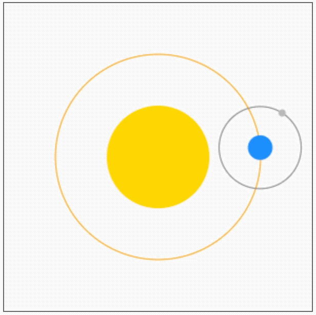

## 1. 目标

- 看懂 demos 即可。

## 2. 评价

- 本节的“太阳系” demo 来源于菜鸟教程上的 canvas 教程。
- 理解 demo 原理的几个核心要点：
  - 地球相对于太阳转动，坐标是相对于太阳原点的；
  - 月球相对于地球转动，坐标是相对于地球原点的；
  - 在绘制地球的时候，原点挪动到了地球的中心；
  - 在绘制月球时，原点挪动到了月球的中心；
  - 每次渲染完成后，将所有状态恢复 restore，重复上述流程；

## 3. demos.1 - 太阳系

::: code-group

```js [1.js]
let sun
let earth
let moon
let ctx

function init() {
  let canvas = document.querySelector('#solar')
  ctx = canvas.getContext('2d')

  // 初始化天体对象
  sun = { radius: 50, color: '#FFD700' }
  earth = { radius: 12, color: '#1E90FF' }
  moon = { radius: 3.5, color: '#C0C0C0' }

  draw()
}

function drawSun() {
  ctx.save()
  ctx.beginPath()
  ctx.arc(150, 150, sun.radius, 0, 2 * Math.PI)
  ctx.fillStyle = sun.color
  ctx.fill()

  ctx.restore()
}

function drawEarth(x, y) {
  ctx.save()
  ctx.beginPath()
  ctx.arc(x, y, earth.radius, 0, 2 * Math.PI)
  ctx.fillStyle = earth.color
  ctx.fill()

  ctx.restore()
}

function drawMoon(x, y) {
  ctx.save()
  ctx.beginPath()
  ctx.arc(x, y, moon.radius, 0, 2 * Math.PI)
  ctx.fillStyle = moon.color
  ctx.fill()

  ctx.restore()
}

function draw() {
  // 每次重绘前清空画布
  ctx.clearRect(0, 0, 300, 300)

  // 绘制太阳
  drawSun()

  ctx.save()
  ctx.translate(150, 150)

  // 绘制地球轨道
  ctx.beginPath()
  ctx.strokeStyle = 'orange'
  ctx.arc(0, 0, 100, 0, 2 * Math.PI)
  ctx.stroke()

  let time = new Date()
  // 计算地球位置
  // 假定地球 60s 转一圈（绕着太阳）
  const earthAngle =
    ((2 * Math.PI) / 60) * time.getSeconds() + // 计算基于秒数的角度变化
    ((2 * Math.PI) / 60000) * time.getMilliseconds() // 计算基于毫秒的精细角度变化
  ctx.rotate(earthAngle)
  ctx.translate(100, 0)

  // 绘制地球
  drawEarth(0, 0)

  // 绘制月球轨道
  ctx.beginPath()
  ctx.strokeStyle = 'gray'
  ctx.arc(0, 0, 40, 0, 2 * Math.PI)
  ctx.stroke()

  // 计算月球位置
  // 假定月球 6s 旋转一圈（绕着地球）
  const moonAngle =
    ((2 * Math.PI) / 6) * time.getSeconds() + // 计算基于秒数的角度变化
    ((2 * Math.PI) / 6000) * time.getMilliseconds() // 计算基于毫秒的精细角度变化
  ctx.rotate(moonAngle)
  ctx.translate(40, 0)

  // 绘制月球
  drawMoon(0, 0)

  ctx.restore()

  requestAnimationFrame(draw)
}

init()
```

```html [1.html]
<!DOCTYPE html>
<html lang="en">
  <head>
    <meta charset="UTF-8" />
    <meta name="viewport" content="width=device-width, initial-scale=1.0" />
    <title>Document</title>
    <style>
      canvas {
        border: 1px solid #666;
      }
    </style>
  </head>
  <body>
    <canvas width="300" height="300" id="solar"></canvas>
    <script src="./1.js"></script>
  </body>
</html>
```

:::

- 最终效果：
  - 
- 原理简述：
  - 初始化设置：定义了三个天体对象（太阳、地球、月球）和绘图上下文 `ctx`，并在 `init` 函数中设置画布和天体参数
  - 天体绘制函数：
    - `drawSun()`：在画布中心绘制太阳（黄色圆形）
    - `drawEarth(x, y)`：在指定位置绘制地球（蓝色圆形）
    - `drawMoon(x, y)`：在指定位置绘制月球（灰色圆形）
  - 动画主循环：draw 函数使用 `requestAnimationFrame` 实现动画循环，每次重绘前清空画布
  - 坐标变换：使用 `ctx.translate` 将原点移动到画布中心，简化天体位置计算
  - 通过 `ctx.rotate` 和 `ctx.translate` 的组合实现地球绕太阳公转、月球绕地球公转的效果。基于当前时间计算地球和月球的旋转角度，demo 中模拟地球绕着太阳转一圈的耗时是 60s，月球绕着地球转一圈的耗时是 6s。

## 4. 引用

- [菜鸟教程 - 学习 HTML5 Canvas 这一篇文章就够了][1]

[1]: https://www.runoob.com/w3cnote/html5-canvas-intro.html
