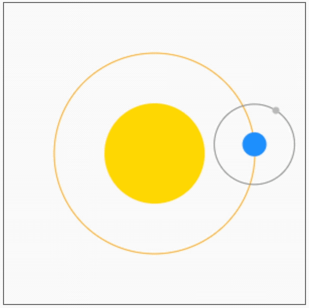

# [0034. 模拟太阳系效果](https://github.com/tnotesjs/TNotes.canvas/tree/main/notes/0034.%20%E6%A8%A1%E6%8B%9F%E5%A4%AA%E9%98%B3%E7%B3%BB%E6%95%88%E6%9E%9C)

<!-- region:toc -->

- [1. 🎯 目标](#1--目标)
- [2. 🫧 评价](#2--评价)
- [3. 💻 demos.1 - 太阳系](#3--demos1---太阳系)
- [4. 🔗 References](#4--references)

<!-- endregion:toc -->

## 1. 🎯 目标

- 看懂 demos 即可。

## 2. 🫧 评价

- 本节的“太阳系” demo 来源于菜鸟教程上的 canvas 教程。
- 理解 demo 原理的几个核心要点：
  - 地球相对于太阳转动，坐标是相对于太阳原点的；
  - 月球相对于地球转动，坐标是相对于地球原点的；
  - 在绘制地球的时候，原点挪动到了地球的中心；
  - 在绘制月球时，原点挪动到了月球的中心；
  - 每次渲染完成后，将所有状态恢复 restore，重复上述流程；

## 3. 💻 demos.1 - 太阳系

::: code-group

<<< ./demos/1/1.js {}

<<< ./demos/1/1.html {}

:::

- 最终效果：
  - 
- 原理简述：
  - 初始化设置：定义了三个天体对象（太阳、地球、月球）和绘图上下文 `ctx`，并在 `init` 函数中设置画布和天体参数
  - 天体绘制函数：
    - `drawSun()`：在画布中心绘制太阳（黄色圆形）
    - `drawEarth(x, y)`：在指定位置绘制地球（蓝色圆形）
    - `drawMoon(x, y)`：在指定位置绘制月球（灰色圆形）
  - 动画主循环：draw 函数使用 `requestAnimationFrame` 实现动画循环，每次重绘前清空画布
  - 坐标变换：使用 `ctx.translate` 将原点移动到画布中心，简化天体位置计算
  - 通过 `ctx.rotate` 和 `ctx.translate` 的组合实现地球绕太阳公转、月球绕地球公转的效果。基于当前时间计算地球和月球的旋转角度，demo 中模拟地球绕着太阳转一圈的耗时是 60s，月球绕着地球转一圈的耗时是 6s。

## 4. 🔗 References

- [菜鸟教程 - 学习 HTML5 Canvas 这一篇文章就够了][1]

[1]: https://www.runoob.com/w3cnote/html5-canvas-intro.html
