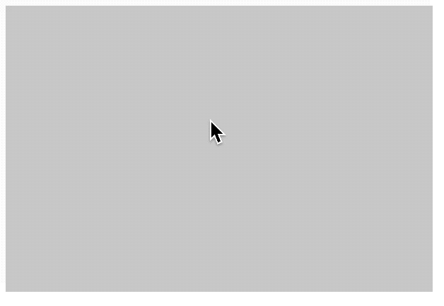
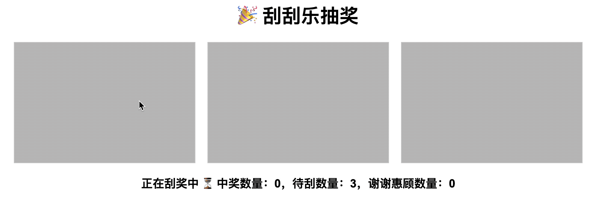

## 1. 目标

- 看懂实现原理即可

## 2. 评价

- “刮刮乐”效果核心逻辑是通过 `ctx.globalCompositeOperation = 'destination-out'` 来实现的。
- 核心步骤：
  - 1️⃣ 先画一个铺满的灰色矩形
  - 2️⃣ 再通过监听鼠标移动绘制线条
  - 3️⃣ 第二步的线条和第一步的灰色矩形的所有重叠区域都会变为透明
- demos.2 在 demos1 的基础上做了一些扩展：
  - 随机生成指定数量个结果，而不是直接在 html 中写死结果；
  - 对抽奖结果做了监听和统计；
  - 判断是否抽过的核心逻辑：只要刮过就判定为这张抽奖卡片的结果已公布；

## 3. demos.1 - 刮刮乐

::: code-group

```html [1.html]
<!DOCTYPE html>
<html lang="en">
  <head>
    <meta charset="UTF-8" />
    <meta http-equiv="X-UA-Compatible" content="IE=edge" />
    <meta name="viewport" content="width=device-width, initial-scale=1.0" />
    <link rel="stylesheet" href="./1.css" />
    <title>Document</title>
  </head>
  <body>
    <div id="result">谢谢惠顾</div>
    <script src="./1.js"></script>
  </body>
</html>
```

```js {13} [1.js]
const canvas = document.createElement('canvas')
canvas.width = 300
canvas.height = 200
document.body.append(canvas)

const ctx = canvas.getContext('2d')

// 绘制填充矩形，将结果盖住。
ctx.beginPath()
ctx.fillStyle = '#ccc'
ctx.fillRect(0, 0, 300, 200)

ctx.globalCompositeOperation = 'destination-out'
// destination-out 旧图形和新图形在不重叠的部分显示，重叠的部分透明。
// 这意味着如果在旧图形上绘制新图形，重叠的部分会被删除。

ctx.beginPath()
// ctx.strokeStyle = '#fff' // 这里是否设置颜色都可以
ctx.lineWidth = 20
ctx.lineCap = 'round'
ctx.lineJoin = 'round'

canvas.onmousedown = function (e) {
  ctx.moveTo(e.offsetX, e.offsetY)

  // 按下鼠标之后就不断地画线
  canvas.onmousemove = function (e) {
    ctx.lineTo(e.offsetX, e.offsetY)
    ctx.stroke()
  }

  canvas.onmouseup = canvas.onmouseout = function () {
    canvas.onmousemove = null
    canvas.onmouseout = null
  }
}
```

```css [1.css]
/*
使用绝对定位的方式
让结果和 canvas 绘制在同一块区域
 */
canvas {
  border: 1px solid #ccc;
  margin-right: 5px;
  position: absolute;
}

#result {
  width: 300px;
  height: 200px;
  text-align: center;
  line-height: 200px;
  font-size: 3rem;
  position: absolute;

  /* 防止文本内容被选中 */
  user-select: none;
}
```

:::

- 最终效果：
  - 

## 4. demos.2 - 多张刮刮乐

::: code-group

```html [1.html]
<!DOCTYPE html>
<html lang="en">
  <head>
    <meta charset="UTF-8" />
    <meta http-equiv="X-UA-Compatible" content="IE=edge" />
    <meta name="viewport" content="width=device-width, initial-scale=1.0" />
    <title>刮刮乐抽奖</title>
    <link rel="stylesheet" href="1.css" />
  </head>
  <body>
    <h1>🎉 刮刮乐抽奖</h1>
    <div id="cards"></div>
    <div id="stats"></div>

    <script src="1.js"></script>
  </body>
</html>
```

```js {33} [1.js]
const results = []

const cardCount = 3
let scratchedCount = 0

// 随机生成 3 个结果
for (let i = 0; i < cardCount; i++) {
  results.push(Math.random() < 0.5 ? '谢谢惠顾' : '再来一瓶')
}

const cardsContainer = document.getElementById('cards')
const stats = document.getElementById('stats')

// 渲染 3 张卡片
results.forEach((result, index) => {
  const card = document.createElement('div')
  card.className = 'card'

  const resultDiv = document.createElement('div')
  resultDiv.className = 'result'
  resultDiv.innerText = result
  card.appendChild(resultDiv)

  const canvas = document.createElement('canvas')
  canvas.width = 300
  canvas.height = 200
  card.appendChild(canvas)

  const ctx = canvas.getContext('2d')
  ctx.fillStyle = '#bbb'
  ctx.fillRect(0, 0, canvas.width, canvas.height)

  ctx.globalCompositeOperation = 'destination-out'
  ctx.lineWidth = 20
  ctx.lineCap = 'round'
  ctx.lineJoin = 'round'

  let scratched = false

  canvas.onmousedown = function (e) {
    ctx.moveTo(e.offsetX, e.offsetY)

    canvas.onmousemove = function (e) {
      ctx.lineTo(e.offsetX, e.offsetY)
      ctx.stroke()

      if (!scratched) {
        scratched = true
        scratchedCount++
        updateStats()
      }
    }

    canvas.onmouseup = canvas.onmouseout = function () {
      canvas.onmousemove = null
      canvas.onmouseout = null
    }
  }

  cardsContainer.appendChild(card)
})

function updateStats() {
  const winCount = results.filter(
    (r, i) => scratchedCount > i && r === '再来一瓶'
  ).length
  const loseCount = results.filter(
    (r, i) => scratchedCount > i && r === '谢谢惠顾'
  ).length
  const total = results.length

  if (scratchedCount === total) {
    stats.innerText = `已完成所有抽奖 ✅ 中奖数量：${winCount}，谢谢惠顾数量：${loseCount}`
  } else {
    stats.innerText = `正在刮奖中 ⏳ 中奖数量：${winCount}，待刮数量：${
      total - scratchedCount
    }，谢谢惠顾数量：${loseCount}`
  }
}

// 初始化状态
updateStats()
```

```css [1.css]
body {
  font-family: Arial, sans-serif;
  text-align: center;
  margin: 20px;
}

#cards {
  display: flex;
  justify-content: center;
  gap: 20px;
  margin-bottom: 20px;
}

.card {
  position: relative;
  width: 300px;
  height: 200px;
  border: 1px solid #ccc;
}

.card .result {
  width: 100%;
  height: 100%;
  line-height: 200px;
  font-size: 2rem;
  user-select: none;
  position: absolute;
  top: 0;
  left: 0;
}

.card canvas {
  position: absolute;
  top: 0;
  left: 0;
}

#stats {
  font-size: 1.2rem;
  font-weight: bold;
}
```

:::

- 最终效果：
  - 
