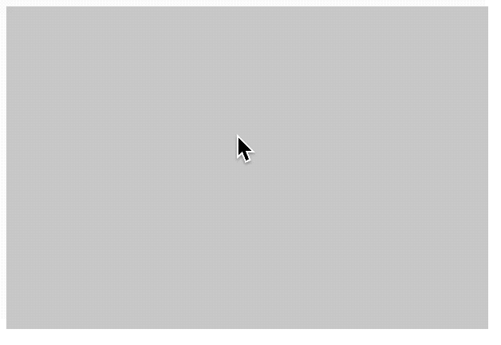
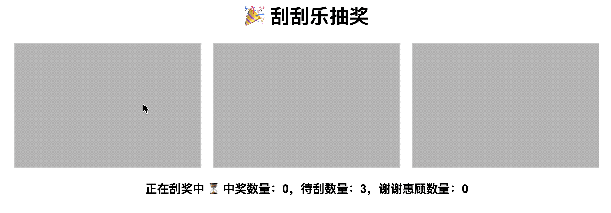

# [0038. 使用 ctx.globalCompositeOperation 实现刮刮乐效果](https://github.com/tnotesjs/TNotes.canvas/tree/main/notes/0038.%20%E4%BD%BF%E7%94%A8%20ctx.globalCompositeOperation%20%E5%AE%9E%E7%8E%B0%E5%88%AE%E5%88%AE%E4%B9%90%E6%95%88%E6%9E%9C)

<!-- region:toc -->

- [1. 🎯 目标](#1--目标)
- [2. 🫧 评价](#2--评价)
- [3. 💻 demos.1 - 刮刮乐](#3--demos1---刮刮乐)
- [4. 💻 demos.2 - 多张刮刮乐](#4--demos2---多张刮刮乐)

<!-- endregion:toc -->

## 1. 🎯 目标

- 看懂实现原理即可

## 2. 🫧 评价

- “刮刮乐”效果核心逻辑是通过 `ctx.globalCompositeOperation = 'destination-out'` 来实现的。
- 核心步骤：
  - 1️⃣ 先画一个铺满的灰色矩形
  - 2️⃣ 再通过监听鼠标移动绘制线条
  - 3️⃣ 第二步的线条和第一步的灰色矩形的所有重叠区域都会变为透明
- demos.2 在 demos1 的基础上做了一些扩展：
  - 随机生成指定数量个结果，而不是直接在 html 中写死结果；
  - 对抽奖结果做了监听和统计；
  - 判断是否抽过的核心逻辑：只要刮过就判定为这张抽奖卡片的结果已公布；

## 3. 💻 demos.1 - 刮刮乐

::: code-group

<<< ./demos/1/1.html {}

<<< ./demos/1/1.js {13}

<<< ./demos/1/1.css {}

:::

- 最终效果：
  - 

## 4. 💻 demos.2 - 多张刮刮乐

::: code-group

<<< ./demos/2/1.html {}

<<< ./demos/2/1.js {33}

<<< ./demos/2/1.css {}

:::

- 最终效果：
  - 
