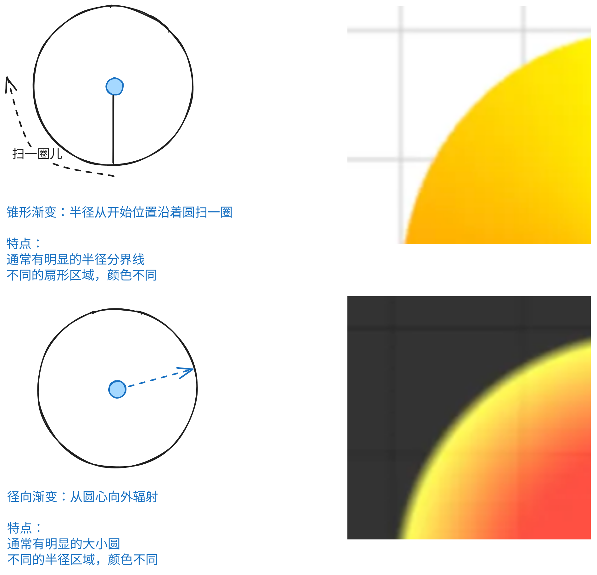

## 1. 目标

- 掌握 `ctx.createRadialGradient` 的基本使用

## 2. 评价

- 镜像渐变 `ctx.createRadialGradient` 的创建非常简单，就是定义俩圆（圆心坐标 + 半斤长度，这意味着需要传入 6 个参数），从圆 1 边缘到圆 2 边缘实现渐变效果。
- 不要把镜像渐变 `ctx.createRadialGradient` 和锥形渐变 `ctx.createConicGradient` 搞错了，要能够区分开两种效果。
- 

## 3. `ctx.createRadialGradient`

- `ctx.createRadialGradient` 用于创建径向渐变（或称为放射状渐变）。
- `createRadialGradient(x0, y0, r0, x1, y1, r1)`
  - `x0, y0, r0` 圆 1
  - `x1, y1, r1` 圆 2
  - 渐变效果将从圆 1 的边缘开始渐变到圆 2 的边缘。

## 4. demos.1 - `ctx.createRadialGradient` 的基本使用

::: code-group

```html {26-47,58-69} [1.html]
<!DOCTYPE html>
<html lang="en">
  <head>
    <meta charset="UTF-8" />
    <meta http-equiv="X-UA-Compatible" content="IE=edge" />
    <meta name="viewport" content="width=device-width, initial-scale=1.0" />
    <title>Document</title>
    <style>
      canvas {
        border: 1px solid #888;
        margin-right: 5px;
      }
    </style>
  </head>
  <body>
    <script src="../common/drawGrid.js"></script>
    <script>
      {
        const canvas = document.createElement('canvas')
        drawGrid(canvas, 400, 400, 50)
        document.body.append(canvas)
        const ctx = canvas.getContext('2d')
        ctx.beginPath()
        ctx.globalAlpha = 0.8

        // createRadialGradient(x0, y0, r0, x1, y1, r1)
        // x0, y0, r0: 渐变的起点坐标和半径
        // x1, y1, r1: 渐变的终点坐标和半径

        // 注意：两个圆是包含关系。
        // 即一个圆在另一个圆的内部。
        const gradient = ctx.createRadialGradient(200, 200, 50, 200, 200, 100)
        // 表示从 (200, 200) 半径为 50 的圆开始渐变
        // 到 (200, 200) 半径为 100 的圆结束渐变

        gradient.addColorStop(0, 'red')
        // 表示渐变的起点颜色为红色
        gradient.addColorStop(0.9, 'yellow')
        // 表示渐变到 90% 的位置时的颜色为黄色
        gradient.addColorStop(1, 'black')
        // 表示渐变的终点颜色为黑色

        ctx.fillStyle = gradient

        ctx.rect(0, 0, canvas.width, canvas.height)
        ctx.stroke()
        ctx.fill()
      }

      {
        const canvas = document.createElement('canvas')
        drawGrid(canvas, 400, 400, 50)
        document.body.append(canvas)
        const ctx = canvas.getContext('2d')
        ctx.beginPath()
        ctx.globalAlpha = 0.8

        const gradient = ctx.createRadialGradient(200, 200, 100, 200, 200, 50)
        // 表示从 (200, 200) 半径为 100 的圆开始渐变
        // 到 (200, 200) 半径为 50 的圆结束渐变

        gradient.addColorStop(0, 'red')
        gradient.addColorStop(0.9, 'yellow')
        gradient.addColorStop(1, 'black')
        ctx.fillStyle = gradient

        ctx.rect(0, 0, canvas.width, canvas.height)
        ctx.stroke()
        ctx.fill()
      }
    </script>
  </body>
</html>
```

:::


## 5. 引用

- [CanvasRenderingContext2D.createRadialGradient 方法][1]

[1]: https://developer.mozilla.org/en-US/docs/Web/API/CanvasRenderingContext2D/createRadialGradient
