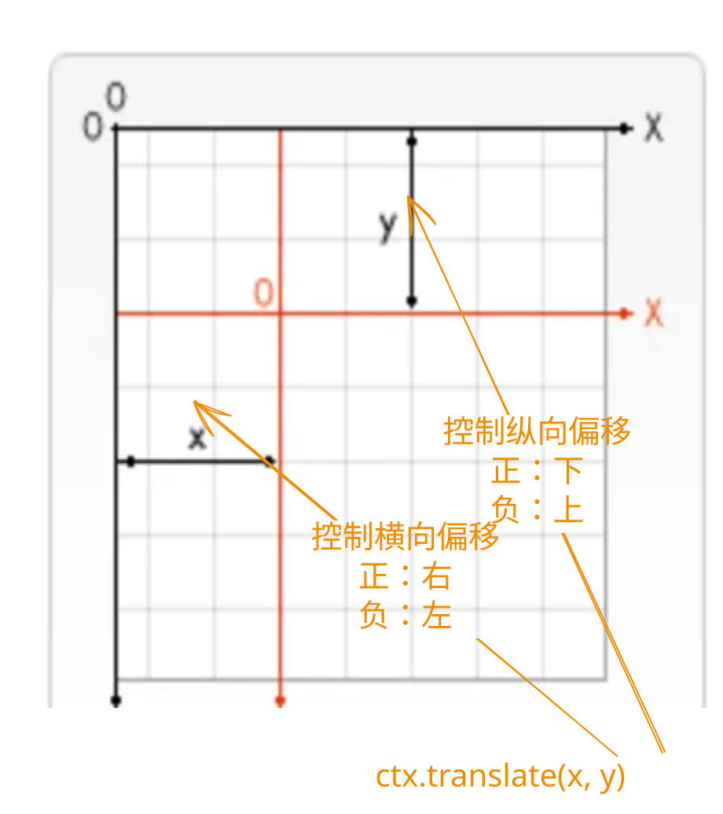

## 1. 目标

- 掌握 `ctx.translate` 的基本使用。

## 2. 评价

- 需要注意的是使用 `ctx.translate` 对坐标进行移动之后，对后续作图的影响。
- `demos.2` 使用 `ctx.rect`、`ctx.fillRect`、`ctx.translate` 绘制出了一个菱形，这算是一种绘制菱形的取巧方案（用 rotate 旋转矩形），可以了解一下这种实现方式的思路。
  - 类似的，对于任何图形（可以通过标准绘图 API 绘制的图形旋转得到的图形），都可以通过类似的方案绘制出来。
  - 在绘制菱形等其它不规则图形的时候，更多情况下会优先使用更加灵活的 `path` 来实现。

## 3. `ctx.translate`

- `ctx.translate(x, y)`
  - `ctx.translate` 用于移动画布和其原点到一个新的位置，可以通过正负值来控制偏移的方向。
  - `x` 在水平方向上移动的距离。正值向右移动，负值向左移动。
  - `y` 在垂直方向上移动的距离。正值向下移动，负值向上移动。
  - 
- 注意：
  - 这玩意儿移动的是整个坐标系，而非指定的某个图像。
  - 这种变换是对后续的所有画布绘制操作起作用的，而不会影响已经绘制到画布上的内容。

## 4. demos.1 - 坐标偏移

::: code-group

```html {20-34} [1.html]
<!DOCTYPE html>
<html lang="en">
  <head>
    <meta charset="UTF-8" />
    <meta http-equiv="X-UA-Compatible" content="IE=edge" />
    <meta name="viewport" content="width=device-width, initial-scale=1.0" />
    <title>Document</title>
  </head>
  <body>
    <script src="../common/drawGrid.js"></script>
    <script>
      const canvas = document.createElement('canvas')
      drawGrid(canvas, 300, 300, 50)
      document.body.append(canvas)
      const ctx = canvas.getContext('2d')

      ctx.beginPath()
      ctx.globalAlpha = 0.5

      // 原始绘制
      ctx.fillStyle = 'red'
      ctx.fillRect(0, 0, 100, 100)
      // 在 (0, 0) 处绘制一个红色矩形，矩形尺寸为 100x100。

      ctx.translate(150, 150)
      // 移动坐标原点到 (150, 150)
      // 这一操作，仅会对后续绘制的图像起作用，而不会影响已经绘制到画布上的内容。

      // 在新的坐标原点绘制蓝色矩形
      ctx.fillStyle = 'blue'
      ctx.fillRect(0, 0, 100, 100)
      // 在 (0, 0) 处绘制一个蓝色矩形，矩形尺寸为 100x100。

      // 两次绘制矩形的位置都是 (0, 0)，但是由于坐标原点的不同，导致了两次绘制的位置不同。
    </script>
  </body>
</html>
```

```html {23} [2.html]
<!DOCTYPE html>
<html lang="en">
  <head>
    <meta charset="UTF-8" />
    <meta http-equiv="X-UA-Compatible" content="IE=edge" />
    <meta name="viewport" content="width=device-width, initial-scale=1.0" />
    <title>Document</title>
  </head>
  <body>
    <script src="../common/drawGrid.js"></script>
    <script>
      const canvas = document.createElement('canvas')
      drawGrid(canvas, 300, 300, 50)
      document.body.append(canvas)
      const ctx = canvas.getContext('2d')

      ctx.beginPath()
      ctx.globalAlpha = 0.5

      ctx.fillStyle = 'red'
      ctx.fillRect(0, 0, 100, 100)

      ctx.translate(100, 200)

      ctx.fillStyle = 'blue'
      ctx.fillRect(0, 0, 100, 100)
    </script>
  </body>
</html>
```

:::

- `1.html`
  - `ctx.fillRect(0, 0, 100, 100)`
    - 两次绘制矩形使用的位置和尺寸参数都是相同的，但是位置却是不同的。
    - 第一次绘制的“红色”矩形所在的开始位置正好就是 `(0, 0)` 点，也就是坐标偏移前的原始原点。
    - 第二次绘制的时候，坐标系相对位置发生了偏移 `ctx.translate(150, 150)`，这就导致了第二次绘制的“蓝色”矩形的位置也同样发生了偏移。
  - 
- `2.html`
  - `ctx.translate(100, 200)`
    - x 向右偏移 100px
    - y 向下偏移 200px
  - 

## 5. demos.2 - 绘制菱形

- 需求描述：
  - 画布上有一个正方形，请通过 `ctx.rotate` 旋转，将这个正方形变为菱形。
  - 要求正方形中心位置和旋转后得到的菱形的中心位置是一样的。

::: code-group

```html [1.html]
<!DOCTYPE html>
<html lang="en">
  <head>
    <meta charset="UTF-8" />
    <meta http-equiv="X-UA-Compatible" content="IE=edge" />
    <meta name="viewport" content="width=device-width, initial-scale=1.0" />
    <title>Document</title>
  </head>
  <body>
    <script src="../common/drawGrid.js"></script>
    <script>
      const canvas = document.createElement('canvas')
      drawGrid(canvas, 150, 150, 50)
      document.body.append(canvas)
      const ctx = canvas.getContext('2d')

      ctx.beginPath()

      // 假设正方形绘制在 (50, 50) 位置，宽高为 50。
      ctx.strokeStyle = 'red'
      ctx.setLineDash([10])
      ctx.strokeRect(50, 50, 50, 50)

      // 1. 将坐标轴的原点设置为旋转矩形的中心
      ctx.translate(75, 75)
      // 2. 坐标轴旋转 45° 再绘制矩形，就可以得到菱形了
      ctx.rotate((45 * Math.PI) / 180)
      // 3. 绘制矩形，但是需要注意旋转后的坐标原点的变化。
      ctx.fillStyle = 'blue'
      ctx.rect(-25, -25, 50, 50)
      // 注意：
      // 坐标轴的位置发生了变化
      // 如果想要在原始图形的中心绘制菱形，需要将矩形的位置设置为 (-25, -25)
      // 这里的 (-25, -25) 是基于原始图形的位置和坐标偏移位置计算出来的结果 (50 - 75, 50 - 75)
      ctx.fill()
    </script>
  </body>
</html>
```

:::

- `ctx.translate` 对画布进行平移，会导致后续绘图时，参考坐标系的变化。
- 比如，`ctx.rotate` 旋转的中心点默认是左上角的原点位置，如果在旋转之前使用了 `ctx.translate` 对画布进行了平移，这将会导致坐标原点发生变化，进而导致 `ctx.rotate` 的旋转中心发生变化。
- 

## 6. 引用

- [CanvasRenderingContext2D.translate 方法][1]

[1]: https://developer.mozilla.org/en-US/docs/Web/API/CanvasRenderingContext2D/translate
