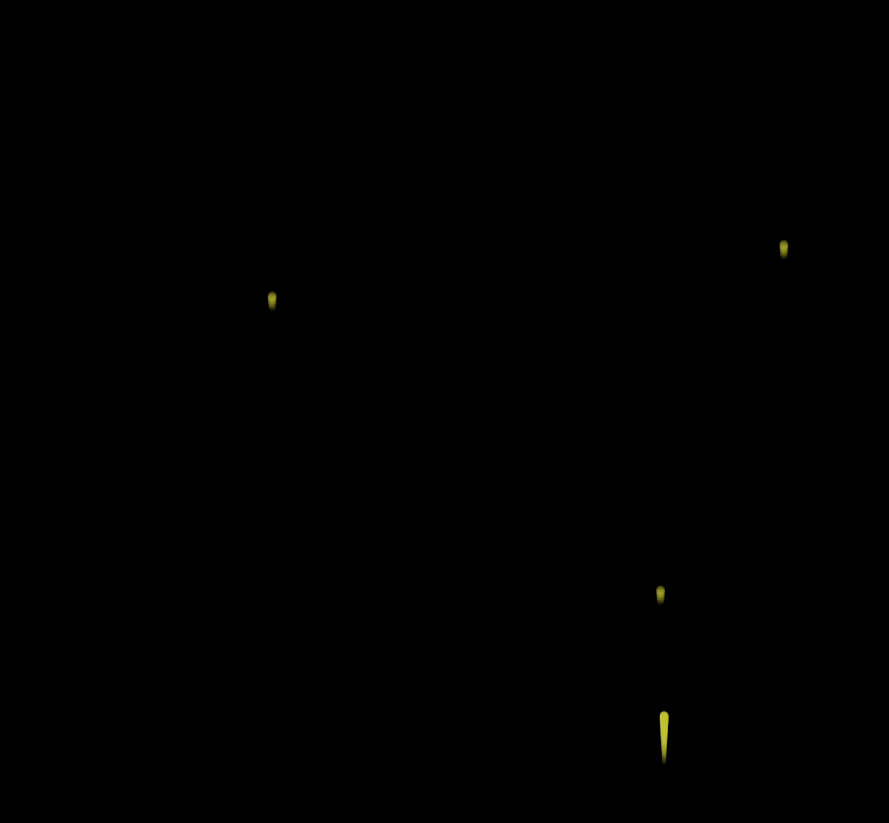

# [0049. 模拟烟花效果](https://github.com/Tdahuyou/TNotes.canvas/tree/main/notes/0049.%20%E6%A8%A1%E6%8B%9F%E7%83%9F%E8%8A%B1%E6%95%88%E6%9E%9C)

<!-- region:toc -->

- [1. 🎯 目标](#1--目标)
- [2. 🫧 评价](#2--评价)
- [3. 💻 demos.1 - 实现烟花的上升过程](#3--demos1---实现烟花的上升过程)
- [4. 💻 demos.2 - 实现爆炸过程](#4--demos2---实现爆炸过程)

<!-- endregion:toc -->

## 1. 🎯 目标

- 理解烟花效果的实现原理

## 2. 🫧 评价

- 本节实现了一个简易版本的模拟烟花爆炸的可视化效果，重点有两个：
  - demos.1 - 烟花的 **上升** 过程；
  - demos.2 - 烟花的 **爆炸** 过程；
- 🎇 烟花实现原理的简单分析：
  - 上升过程，本质就是改变小球的纵坐标，难点可能在于上升尾迹的绘制上，这个尾迹的实现起始就是以上升的小球作为参考，在它后边儿继续绘制若干个小球，y 和 r 都减小一些，调好参数，看起来像是一个倒置的 💧 水滴效果即可。
  - 爆炸过程，先说说爆炸的本质，就是在爆炸的时刻，把原先上升的小球都干掉，然后基于小球上升到的终点坐标，再绘制若干个小球（爆炸颗粒），这些爆炸颗粒的运动方向设置为随机值，这些粒子向各方向散开的时候速度不断降低，设置好一个阈值，低于这个阈值的时候将这些粒子也干掉，这就完成了爆炸环节。
    - 在爆炸过程中，还有一个爆炸时刻的把控，这有很多种做法，比如可以设置一个烟花上升的时间阈值，当一个烟花诞生之后，它必然会在诞生后几秒内爆炸，但 demos 中采用的方案是通过画面上的烟花数量来控制的，比如我们只允许画面上最多出现 10 个烟花，那么当第 11 个烟花出现的时候，就是第 1 个烟花该爆炸的时候。
- 烟花爆炸最终效果：
  - 

## 3. 💻 demos.1 - 实现烟花的上升过程

::: code-group

<<< ./demos/1/index.js

<<< ./demos/1/index.css

<<< ./demos/1/index.html

:::

- 烟花 - 上升过程分析
  - 把烟花模拟成一个黄色的圆。
  - 每间隔 50 帧，放一个烟花。
  - 页面上烟花数量的上限为 5 个。
    - 第 n 个烟花出现，意味着第 n - 5 爆炸。
    - 爆炸后的烟花意味着消失。
  - 烟花上升的速度是一个随机值。
  - 烟花上升的过程中有尾迹效果，类似一个水滴 💧 形状。
    - 大圆在上，小尖尖在下。
    - 从大圆到小尖尖，亮度不断降低。
  - 
  - 烟花上升过程中，透明度不断地降低。
- 最终效果：
  - 

## 4. 💻 demos.2 - 实现爆炸过程

- html、css 保持不变，主要扩展 index.js 文件。

::: code-group

<<< ./demos/2/index.js {56-80,102-132}

<<< ./demos/2/index.css

<<< ./demos/2/index.html

:::

- 上述的高亮区域是主要修改的内容，index.html、index.css 中的内容是没有发生变化的。
- 主要加了一个粒子类，用于创建爆炸后的烟花的粒子实例。
- 烟花 - 爆炸过程分析
  - **烟花的爆炸原理**：爆炸后的烟花，本质上就是绘制若干个小球，小球的数量由 `this.particleCount` 变量来表示。所有爆炸的粒子实例存储在 `this.particles` 数组中，每次更新烟花 `Firework.update()` 的时候需要去绘制俩玩意儿：
    - 【1】还没爆炸的烟花 `Firework.activeFireworks`
    - 【2】已经爆炸的烟花 `Firework.explodeFireworks`
  - 还没爆炸的烟花，绘制逻辑就是前面提到的烟花上升逻辑，保持不变即可。
  - 爆炸后的烟花，需要将烟花实例存储到 `Firework.explodeFireworks` 中，然后遍历所有已经爆炸的烟花实例，创建爆炸粒子、更新爆炸粒子的状态。
- 最终效果：
  - 
