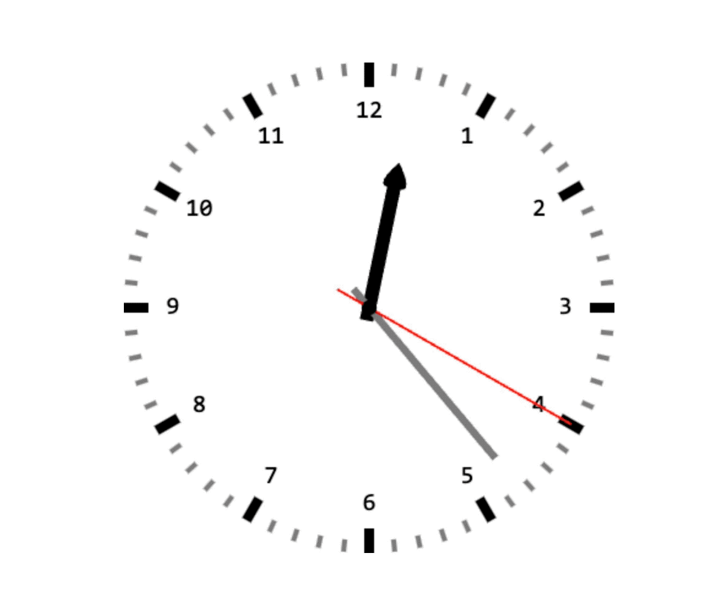
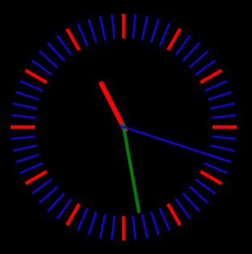

## 1. 目标

- 理解 canvas 时钟效果的实现逻辑

## 2. 评价

- `demos.1` UI 随便写写，重点在于理解 canvas 时钟效果的实现逻辑。
- `demos.2` 来源于菜鸟教程上的 canvas 教程，核心逻辑基本都是一样的，可以对比着看看。

::: swiper





:::

## 3. demos.1 - 动态始终效果实现源码

::: code-group

```js {2-51,55-125} [index.js]
// #region 绘制时钟背景
const clock_bg_canvas = document.createElement('canvas')
document.body.append(clock_bg_canvas)
clock_bg_canvas.width = 400
clock_bg_canvas.height = 400

let ctx = clock_bg_canvas.getContext('2d')

// 移动原点置容器中心，以便后续绘制操作。
ctx.translate(200, 200)

// 绘制小时刻度
ctx.strokeStyle = 'black'
ctx.lineWidth = 8
for (let i = 0; i < 12; i++) {
  ctx.beginPath()
  ctx.moveTo(0, -200)
  ctx.lineTo(0, -180)
  ctx.stroke()
  ctx.rotate((Math.PI * 2) / 12)
  // 将一圈分为 12 份，每次旋转都是基于上次的位置来旋转的。
  // 一共旋转 12 次，绘制 12 个刻度点。
}

// 绘制分钟刻度
ctx.strokeStyle = 'gray'
ctx.lineWidth = 4
for (let i = 0; i < 60; i++) {
  // 每个小时刻度之间再绘制 5 个分钟刻度，分别表示 10、20、30、40、50 分。
  if (i % 5 != 0) {
    ctx.beginPath()
    ctx.moveTo(0, -200)
    ctx.lineTo(0, -190)
    ctx.stroke()
  }
  ctx.rotate((Math.PI * 2) / 60)
}

// 绘制小时数字
ctx.font = '20px sans-serif'
ctx.textAlign = 'center'
ctx.textBaseline = 'middle'
ctx.fillStyle = 'black'
const r = 160
const angle = (Math.PI * 2) / 12 // 每小时所占的角度，单位为弧度
for (let i = 0; i < 12; i++) {
  const text = i == 0 ? 12 : i
  const x = Math.sin(angle * i) * r
  const y = -Math.cos(angle * i) * r
  ctx.fillText(text, x, y)
}
// #endregion 绘制时钟背景

// #region 绘制动态的指针
const canvas = document.createElement('canvas')
document.body.append(canvas)
canvas.width = 400
canvas.height = 400
ctx = canvas.getContext('2d')

ctx.translate(200, 200)

function start() {
  // 清除画布
  ctx.clearRect(-200, -200, canvas.width, canvas.height)

  // 获得当前时间的时分秒，分别计算表针旋转角度
  const now = new Date()
  const hour = now.getHours() % 12
  const minute = now.getMinutes()
  const second = now.getSeconds()
  const millisecond = now.getMilliseconds()

  // 绘制时针
  ctx.save()
  // 考虑分钟和秒钟对时针位置的影响，实现平滑过渡
  ctx.rotate(
    ((hour * 3600 + minute * 60 + second) * Math.PI * 2) / (60 * 60 * 12)
  )
  ctx.beginPath()
  ctx.moveTo(-5, 10)
  ctx.lineTo(-5, -100)
  // 使用贝塞尔曲线绘制一个心形
  ctx.quadraticCurveTo(-15, -100, 0, -120)
  ctx.quadraticCurveTo(15, -100, 5, -100)
  ctx.lineTo(5, 10)
  ctx.closePath()
  ctx.stroke()
  ctx.fill()
  ctx.restore()

  // 绘制分针
  ctx.save()
  // 考虑秒钟对分针位置的影响，实现平滑过渡
  ctx.rotate(((minute * 60 + second) * Math.PI * 2) / 3600)
  ctx.lineWidth = 6
  ctx.strokeStyle = 'gray'
  ctx.beginPath()
  ctx.moveTo(0, 20)
  ctx.lineTo(0, -160)
  ctx.stroke()
  ctx.restore()

  // 绘制秒针
  ctx.save()
  // 考虑毫秒对秒针位置的影响，实现平滑过渡
  ctx.rotate(((Math.PI * 2) / 60) * (second + millisecond / 1000))
  ctx.lineWidth = 2
  ctx.strokeStyle = 'red'
  ctx.beginPath()
  ctx.moveTo(0, 30)
  ctx.lineTo(0, -190)
  ctx.stroke()
  ctx.restore()

  // 绘制圆心点
  ctx.save()
  ctx.beginPath()
  ctx.arc(0, 0, 6, 0, Math.PI * 2)
  ctx.fill()
  ctx.restore()

  // requestAnimationFrame(start) // 使用 requestAnimationFrame 可实现更流畅的动画效果
  setTimeout(start, 1000)
}
// #endregion 绘制动态的指针

// 启动时钟
start()
```

```css [index.css]
canvas {
  /* border: 2px solid #ccc; */
  /* background-color: black; */
  position: absolute;
  left: 50%;
  top: 50%;
  /* 画布大小是 400px * 400px */
  margin-left: -200px;
  margin-top: -200px;
}
```

```html [index.html]
<!DOCTYPE html>
<html lang="en">
  <head>
    <meta charset="UTF-8" />
    <meta http-equiv="X-UA-Compatible" content="IE=edge" />
    <meta name="viewport" content="width=device-width, initial-scale=1.0" />
    <title>Document</title>
    <link rel="stylesheet" href="index.css" />
  </head>
  <body>
    <script src="index.js"></script>
  </body>
</html>
```

:::

- 最终效果：
  - 
- html、css 没啥可说的，核心逻辑都在 js 中。
- js 主要由两个部分
  1. 静态部分：绘制时钟背景，这一部分主要就是绘制时钟背景所需要的各个组件。
  2. 动态部分：绘制动态的指针，这一部分主要通过 js 来控制 3 个指针的转向，每秒更新一次。

## 4. demos.2 - 菜鸟教程版

::: code-group

```js [1.js]
init()

function init() {
  let canvas = document.querySelector('#canvas')
  let ctx = canvas.getContext('2d')
  draw(ctx)
}

function draw(ctx) {
  requestAnimationFrame(function step() {
    drawDial(ctx) //绘制表盘
    drawAllHands(ctx) //绘制时分秒针
    requestAnimationFrame(step)
  })
}
/*绘制时分秒针*/
function drawAllHands(ctx) {
  let time = new Date()

  let s = time.getSeconds()
  let m = time.getMinutes()
  let h = time.getHours()

  let pi = Math.PI
  let secondAngle = (pi / 180) * 6 * s //计算出来s针的弧度
  let minuteAngle = (pi / 180) * 6 * m + secondAngle / 60 //计算出来分针的弧度
  let hourAngle = (pi / 180) * 30 * h + minuteAngle / 12 //计算出来时针的弧度

  drawHand(hourAngle, 60, 6, 'red', ctx) //绘制时针
  drawHand(minuteAngle, 106, 4, 'green', ctx) //绘制分针
  drawHand(secondAngle, 129, 2, 'blue', ctx) //绘制秒针
}
/*绘制时针、或分针、或秒针
 * 参数1：要绘制的针的角度
 * 参数2：要绘制的针的长度
 * 参数3：要绘制的针的宽度
 * 参数4：要绘制的针的颜色
 * 参数4：ctx
 * */
function drawHand(angle, len, width, color, ctx) {
  ctx.save()
  ctx.translate(150, 150) //把坐标轴的远点平移到原来的中心
  ctx.rotate(-Math.PI / 2 + angle) //旋转坐标轴。 x轴就是针的角度
  ctx.beginPath()
  ctx.moveTo(-4, 0)
  ctx.lineTo(len, 0) // 沿着x轴绘制针
  ctx.lineWidth = width
  ctx.strokeStyle = color
  ctx.lineCap = 'round'
  ctx.stroke()
  ctx.closePath()
  ctx.restore()
}

/*绘制表盘*/
function drawDial(ctx) {
  let pi = Math.PI

  ctx.clearRect(0, 0, 300, 300) //清除所有内容
  ctx.save()

  ctx.translate(150, 150) //一定坐标原点到原来的中心
  ctx.beginPath()
  ctx.arc(0, 0, 148, 0, 2 * pi) //绘制圆周
  ctx.stroke()
  ctx.closePath()

  for (let i = 0; i < 60; i++) {
    //绘制刻度。
    ctx.save()
    ctx.rotate(-pi / 2 + (i * pi) / 30) //旋转坐标轴。坐标轴x的正方形从 向上开始算起
    ctx.beginPath()
    ctx.moveTo(110, 0)
    ctx.lineTo(140, 0)
    ctx.lineWidth = i % 5 ? 2 : 4
    ctx.strokeStyle = i % 5 ? 'blue' : 'red'
    ctx.stroke()
    ctx.closePath()
    ctx.restore()
  }
  ctx.restore()
}
```

```html [1.html]
<!DOCTYPE html>
<html lang="en">
  <head>
    <meta charset="UTF-8" />
    <meta name="viewport" content="width=device-width, initial-scale=1.0" />
    <title>Document</title>
    <style>
      canvas {
        background-color: black;
      }
    </style>
  </head>
  <body>
    <canvas width="300" height="300" id="canvas"></canvas>
    <script src="./1.js"></script>
  </body>
</html>
```

:::

- 最终效果：
  - 

## 5. 引用

- [菜鸟教程 - 学习 HTML5 Canvas 这一篇文章就够了][1]

[1]: https://www.runoob.com/w3cnote/html5-canvas-intro.html
