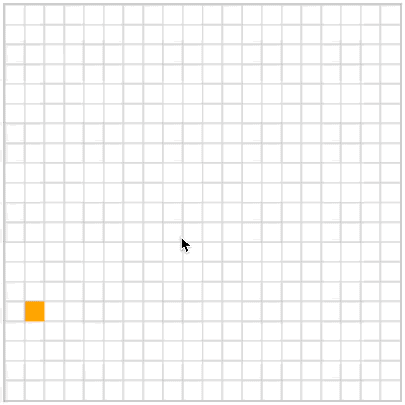

# [0051. 贪吃蛇小游戏](https://github.com/Tdahuyou/TNotes.canvas/tree/main/notes/0051.%20%E8%B4%AA%E5%90%83%E8%9B%87%E5%B0%8F%E6%B8%B8%E6%88%8F)

<!-- region:toc -->

- [1. 📝 概述](#1--概述)
- [2. 📒 贪吃蛇小游戏 - 最终效果](#2--贪吃蛇小游戏---最终效果)
- [3. 📒 贪吃蛇小游戏 - 实现原理分析](#3--贪吃蛇小游戏---实现原理分析)
  - [3.1. 蛇头移动](#31-蛇头移动)
  - [3.2. 游戏结束检查](#32-游戏结束检查)
  - [3.3. 吃食物检查](#33-吃食物检查)
  - [3.4. 蛇身更新](#34-蛇身更新)
  - [3.5. 动画和速度调节](#35-动画和速度调节)
- [4. 💻 demo - 贪吃蛇小游戏 - 实现源码](#4--demo---贪吃蛇小游戏---实现源码)

<!-- endregion:toc -->

## 1. 📝 概述

理解贪吃蛇小游戏的实现的基本原理。

## 2. 📒 贪吃蛇小游戏 - 最终效果



## 3. 📒 贪吃蛇小游戏 - 实现原理分析

贪吃蛇 `Snake` 中的逻辑，是整个游戏的核心。

核心要理解以下逻辑的实现：

- 蛇的移动逻辑
  - 蛇头的移动
  - 蛇身的移动（重点）
- 蛇吃食物的逻辑
- 游戏的结束判定逻辑

### 3.1. 蛇头移动

1. **方向判断**：根据蛇当前的方向，蛇头的位置会更新。这是通过一个 `switch` 语句来实现的，它检查 `this.direction` 的值（即蛇的当前方向），然后根据方向来增减蛇头的 `x` 或 `y` 坐标值。每个方向对应一个坐标轴的变化：

- `ARROW_RIGHT`: `x` 坐标增加 `gridSize`，表示向右移动。
- `ARROW_DOWN`: `y` 坐标增加 `gridSize`，表示向下移动。
- `ARROW_LEFT`: `x` 坐标减少 `gridSize`，表示向左移动。
- `ARROW_UP`: `y` 坐标减少 `gridSize`，表示向上移动。

2. **位置更新**：更新位置后，蛇头的新位置存储在 `this.head.x` 和 `this.head.y` 中。

> 注意：「坐标的更新」和「界面的渲染」是两个步骤。
>
> 坐标位置的更新并不意味着在界面上看到蛇头的位置发生了移动。当你看到界面上蛇头的位置发生了变化，这意味着重新绘制 `draw` 了。
>
> 每次移动 `move` 的时候都是先更新坐标 `x`、`y`，做完一系列的判定之后，最后才重新绘制 `draw` 更新界面。

### 3.2. 游戏结束检查

- **出界检查** (`isOutOfBounds`): 如果蛇头的新位置超出了画布的边界（游戏区域），游戏结束。
- **自身碰撞检查** (`isCollidingWithSelf`): 如果蛇头的新位置与蛇身的任何部分重叠（通过查看网格状态 `gridState` 判断），则游戏也会结束。

### 3.3. 吃食物检查

- **食物检查** (`isEatingFood`): 如果蛇头的新位置与食物的位置相同，蛇将吃掉食物。这会导致蛇的得分增加，并且在蛇身的前端添加一个新的身体部分（即蛇变长）。

### 3.4. 蛇身更新

- **蛇身移动** (`moveBody`): 如果蛇没有吃到食物，蛇身需要更新来跟随蛇头移动。这是通过移除蛇身数组的最后一个元素（尾部），并将其位置设置为蛇头移动前的位置，然后将这个元素插入到数组的开头来实现的。这样，蛇身的每个部分都跟随前一个向前移动，从而实现整体的流畅移动。

### 3.5. 动画和速度调节

- **定时器** (`setTimeout`): 通过使用定时器，蛇的 `move` 方法会周期性地被调用，创建连续移动的效果。移动的速度随着蛇的得分增加而加快，使游戏难度逐渐增大。

```javascript
// 生成食物
let currentFood
// 在画布随机一个空白位置上生成食物
function generateFood() {
  while (true) {
    const x =
      Math.floor((Math.random() * canvasBoard.width) / gridSize) * gridSize
    const y =
      Math.floor((Math.random() * canvasBoard.height) / gridSize) * gridSize
    if (gridState[`${x}-${y}`] === 0) {
      currentFood = new Square(x, y, CELL_TYPE_FOOD, 'orange')
      currentFood.draw()
      break
    }
  }
}
generateFood()
```

```javascript
// 开始游戏
canvasGame.onclick = function () {
  // 地图初始化
  ctxGame.clearRect(0, 0, canvasGame.width, canvasGame.height)
  generateFood()
  initializeGrid()

  // 创建蛇
  const playerSnake = new Snake(10, 10)
  playerSnake.draw()
  playerSnake.move()

  // 监听键盘按下事件
  document.onkeydown = function (event) {
    if (
      // 按下的不是方向键
      ![ARROW_LEFT, ARROW_UP, ARROW_RIGHT, ARROW_DOWN].includes(event.code) ||
      // 按下的是当前运动方向的反方向
      (playerSnake.direction === ARROW_RIGHT && event.code === ARROW_LEFT) ||
      (playerSnake.direction === ARROW_LEFT && event.code === ARROW_RIGHT) ||
      (playerSnake.direction === ARROW_DOWN && event.code === ARROW_UP) ||
      (playerSnake.direction === ARROW_UP && event.code === ARROW_DOWN)
    ) {
      return
    }

    playerSnake.direction = event.code
  }
}
```

## 4. 💻 demo - 贪吃蛇小游戏 - 实现源码

```html
<!-- index.html -->
<!DOCTYPE html>
<html lang="en">
  <head>
    <meta charset="UTF-8" />
    <meta http-equiv="X-UA-Compatible" content="IE=edge" />
    <meta name="viewport" content="width=device-width, initial-scale=1.0" />
    <title>Document</title>
    <link rel="stylesheet" href="index.css" />
  </head>
  <body>
    <script src="index.js"></script>
  </body>
</html>
```

```css
/* index.css */
canvas {
  border: 2px solid #ccc;

  /* 让两个 canvas 重合在一起 */
  position: absolute;
}
```

```javascript
// index.js
// 键盘方向键值
const ARROW_LEFT = 'ArrowLeft'
const ARROW_UP = 'ArrowUp'
const ARROW_RIGHT = 'ArrowRight'
const ARROW_DOWN = 'ArrowDown'

// 网格中的元素类型
const CELL_TYPE_SPACE = 0 // 0 表示空
const CELL_TYPE_SNAKE = 1 // 1 表示蛇
const CELL_TYPE_FOOD = 2 // 2 表示食物

// 单元格颜色
const CELL_COLOR_SNAKE_HEAD = 'red'
const CELL_COLOR_SNAKE_BODY = 'pink'
const CELL_COLOR_FOOD = 'orange'

// #region 画布初始化
const canvasBoard = document.createElement('canvas')
canvasBoard.width = 400
canvasBoard.height = 400
document.body.append(canvasBoard)
const ctxBoard = canvasBoard.getContext('2d')

const canvasGame = document.createElement('canvas')
canvasGame.width = 400
canvasGame.height = 400
document.body.append(canvasGame)
const ctxGame = canvasGame.getContext('2d')
// #endregion 画布初始化

// #region 网格数据初始化
const gridSize = 20
const gridState = {}
function initializeGrid() {
  for (let row = 0; row < canvasBoard.width / gridSize; row++) {
    for (let col = 0; col < canvasBoard.height / gridSize; col++) {
      gridState[`${row * gridSize}-${col * gridSize}`] = CELL_TYPE_SPACE
    }
  }
}
initializeGrid()
// #endregion 网格数据初始化

// #region 绘制网格棋盘
// 这一部分，可以理解为准备游戏地图。
function drawGrid() {
  ctxBoard.save()
  ctxBoard.strokeStyle = '#ccc'
  for (let line = 0; line < canvasBoard.width / gridSize; line++) {
    ctxBoard.beginPath()
    ctxBoard.moveTo(gridSize * line, 0)
    ctxBoard.lineTo(gridSize * line, canvasBoard.height)
    ctxBoard.stroke()

    ctxBoard.beginPath()
    ctxBoard.moveTo(0, gridSize * line)
    ctxBoard.lineTo(canvasBoard.width, gridSize * line)
    ctxBoard.stroke()
  }
  ctxBoard.restore()
}
drawGrid()
// #endregion 绘制网格棋盘

// #region 蛇和食物的基类
class Square {
  constructor(x, y, cell_type, cell_color) {
    this.x = x
    this.y = y
    this.previousX = x
    this.previousY = y
    this.cell_color = cell_color
    this.cell_type = cell_type
  }

  static width = gridSize
  static height = gridSize

  draw() {
    gridState[`${this.previousX}-${this.previousY}`] = CELL_TYPE_SPACE
    gridState[`${this.x}-${this.y}`] = this.cell_type

    ctxGame.clearRect(
      this.previousX,
      this.previousY,
      Square.width,
      Square.height
    )
    this.previousX = this.x
    this.previousY = this.y
    ctxGame.save()
    ctxGame.beginPath()
    ctxGame.fillStyle = this.cell_color
    ctxGame.fillRect(this.x, this.y, Square.width, Square.height)
    ctxGame.restore()
  }
}
// #endregion 蛇和食物的基类

// #region 贪吃蛇
class Snake {
  // 构造函数初始化蛇的位置、方向、头部和身体
  constructor(x, y, direction = 'ArrowRight') {
    this.x = x * gridSize // 横坐标初始化，根据网格大小调整
    this.y = y * gridSize // 纵坐标初始化，根据网格大小调整
    this.direction = direction // 初始方向
    this.head = new Square(
      this.x,
      this.y,
      CELL_TYPE_SNAKE,
      CELL_COLOR_SNAKE_HEAD
    ) // 创建蛇头部的实例
    this.body = [] // 蛇的身体部分数组
    this.score = 0 // 初始化得分
  }

  // 绘制蛇的头部和身体
  draw() {
    this.head.draw() // 绘制蛇头
    this.body.forEach((segment) => segment.draw()) // 绘制蛇身体的每一个部分
  }

  // 控制蛇的移动逻辑
  move() {
    // 根据蛇的当前方向更新蛇头的位置
    switch (this.direction) {
      case ARROW_RIGHT:
        this.head.x += gridSize
        break
      case ARROW_DOWN:
        this.head.y += gridSize
        break
      case ARROW_LEFT:
        this.head.x -= gridSize
        break
      case ARROW_UP:
        this.head.y -= gridSize
        break
    }

    // 检查游戏是否结束（出界或撞到自己）
    if (this.isOutOfBounds() || this.isCollidingWithSelf()) {
      console.log('游戏结束！最终得分：' + this.score) // 弹出游戏结束信息
      return
    }

    // 检查蛇是否吃到食物
    if (this.isEatingFood()) {
      this.score += 10 // 增加分数
      const newSegment = new Square(
        this.head.previousX,
        this.head.previousY,
        CELL_TYPE_SNAKE,
        CELL_COLOR_SNAKE_BODY
      ) // 创建新的身体部分
      this.body.unshift(newSegment) // 将新部分添加到蛇身体的前端
      generateFood() // 重新生成食物
    } else {
      this.moveBody() // 移动身体
    }

    this.draw() // 重绘蛇的新状态

    setTimeout(() => {
      this.move() // 延迟调用move方法，以创建动画效果
    }, 200 - this.score / 2) // 移动速度随分数增加而增快
  }

  // 检查蛇是否出界
  isOutOfBounds() {
    return (
      this.head.x < 0 ||
      this.head.y < 0 ||
      this.head.x >= canvasGame.width ||
      this.head.y >= canvasGame.height
    )
  }

  // 检查蛇是否撞到了自己
  isCollidingWithSelf() {
    return gridState[`${this.head.x}-${this.head.y}`] === CELL_TYPE_SNAKE
  }

  // 检查蛇是否吃到了食物
  isEatingFood() {
    return this.head.x === currentFood.x && this.head.y === currentFood.y
  }

  // 移动蛇身体的逻辑
  // 把尾巴切掉一个格子
  // 然后在头部插入一个格子
  moveBody() {
    if (this.body.length > 0) {
      const tailSegment = this.body.pop() // 移除尾部
      tailSegment.x = this.head.previousX // 更新尾部位置到之前头部的位置
      tailSegment.y = this.head.previousY
      this.body.unshift(tailSegment) // 将尾部添加到头部位置，实现身体的“移动”
    }
  }
}
// #endregion 贪吃蛇

// #region 生成食物
let currentFood
// 在画布随机一个空白位置上生成食物
function generateFood() {
  while (true) {
    const x =
      Math.floor((Math.random() * canvasBoard.width) / gridSize) * gridSize
    const y =
      Math.floor((Math.random() * canvasBoard.height) / gridSize) * gridSize
    if (gridState[`${x}-${y}`] === 0) {
      currentFood = new Square(x, y, CELL_TYPE_FOOD, 'orange')
      currentFood.draw()
      break
    }
  }
}
generateFood()
// #endregion 生成食物

// #region 开始游戏
canvasGame.onclick = function () {
  // 地图初始化
  ctxGame.clearRect(0, 0, canvasGame.width, canvasGame.height)
  generateFood()
  initializeGrid()

  // 创建蛇
  const playerSnake = new Snake(10, 10)
  playerSnake.draw()
  playerSnake.move()

  // 监听键盘按下事件
  document.onkeydown = function (event) {
    if (
      // 按下的不是方向键
      ![ARROW_LEFT, ARROW_UP, ARROW_RIGHT, ARROW_DOWN].includes(event.code) ||
      // 按下的是当前运动方向的反方向
      (playerSnake.direction === ARROW_RIGHT && event.code === ARROW_LEFT) ||
      (playerSnake.direction === ARROW_LEFT && event.code === ARROW_RIGHT) ||
      (playerSnake.direction === ARROW_DOWN && event.code === ARROW_UP) ||
      (playerSnake.direction === ARROW_UP && event.code === ARROW_DOWN)
    ) {
      return
    }

    playerSnake.direction = event.code
  }
}
// #endregion 开始游戏
```

**常量**

```javascript
// 键盘方向键值
const ARROW_LEFT = 'ArrowLeft'
const ARROW_UP = 'ArrowUp'
const ARROW_RIGHT = 'ArrowRight'
const ARROW_DOWN = 'ArrowDown'

// 网格中的元素类型
const CELL_TYPE_SPACE = 0 // 0 表示空
const CELL_TYPE_SNAKE = 1 // 1 表示蛇
const CELL_TYPE_FOOD = 2 // 2 表示食物

// 单元格颜色
const CELL_COLOR_SNAKE_HEAD = 'red'
const CELL_COLOR_SNAKE_BODY = 'pink'
const CELL_COLOR_FOOD = 'orange'
```

**画布初始化**

```javascript
const canvasBoard = document.createElement('canvas')
canvasBoard.width = 400
canvasBoard.height = 400
document.body.append(canvasBoard)
const ctxBoard = canvasBoard.getContext('2d')

const canvasGame = document.createElement('canvas')
canvasGame.width = 400
canvasGame.height = 400
document.body.append(canvasGame)
const ctxGame = canvasGame.getContext('2d')
```

**网格数据初始化**

```javascript
const gridSize = 20
const gridState = {}
function initializeGrid() {
  for (let row = 0; row < canvasBoard.width / gridSize; row++) {
    for (let col = 0; col < canvasBoard.height / gridSize; col++) {
      gridState[`${row * gridSize}-${col * gridSize}`] = CELL_TYPE_SPACE
    }
  }
}
initializeGrid()
```

**绘制网格棋盘**

```javascript
// 这一部分，可以理解为准备游戏地图。
function drawGrid() {
  ctxBoard.save()
  ctxBoard.strokeStyle = '#ccc'
  for (let line = 0; line < canvasBoard.width / gridSize; line++) {
    ctxBoard.beginPath()
    ctxBoard.moveTo(gridSize * line, 0)
    ctxBoard.lineTo(gridSize * line, canvasBoard.height)
    ctxBoard.stroke()

    ctxBoard.beginPath()
    ctxBoard.moveTo(0, gridSize * line)
    ctxBoard.lineTo(canvasBoard.width, gridSize * line)
    ctxBoard.stroke()
  }
  ctxBoard.restore()
}
drawGrid()
```

**蛇和食物的基类**

```javascript
class Square {
  constructor(x, y, cell_type, cell_color) {
    this.x = x
    this.y = y
    this.previousX = x
    this.previousY = y
    this.cell_color = cell_color
    this.cell_type = cell_type
  }

  static width = gridSize
  static height = gridSize

  draw() {
    gridState[`${this.previousX}-${this.previousY}`] = CELL_TYPE_SPACE
    gridState[`${this.x}-${this.y}`] = this.cell_type

    ctxGame.clearRect(
      this.previousX,
      this.previousY,
      Square.width,
      Square.height
    )
    this.previousX = this.x
    this.previousY = this.y
    ctxGame.save()
    ctxGame.beginPath()
    ctxGame.fillStyle = this.cell_color
    ctxGame.fillRect(this.x, this.y, Square.width, Square.height)
    ctxGame.restore()
  }
}
```

**贪吃蛇**

```javascript
class Snake {
  // 构造函数初始化蛇的位置、方向、头部和身体
  constructor(x, y, direction = 'ArrowRight') {
    this.x = x * gridSize // 横坐标初始化，根据网格大小调整
    this.y = y * gridSize // 纵坐标初始化，根据网格大小调整
    this.direction = direction // 初始方向
    this.head = new Square(
      this.x,
      this.y,
      CELL_TYPE_SNAKE,
      CELL_COLOR_SNAKE_HEAD
    ) // 创建蛇头部的实例
    this.body = [] // 蛇的身体部分数组
    this.score = 0 // 初始化得分
  }

  // 绘制蛇的头部和身体
  draw() {
    this.head.draw() // 绘制蛇头
    this.body.forEach((segment) => segment.draw()) // 绘制蛇身体的每一个部分
  }

  // 控制蛇的移动逻辑
  move() {
    // 根据蛇的当前方向更新蛇头的位置
    switch (this.direction) {
      case ARROW_RIGHT:
        this.head.x += gridSize
        break
      case ARROW_DOWN:
        this.head.y += gridSize
        break
      case ARROW_LEFT:
        this.head.x -= gridSize
        break
      case ARROW_UP:
        this.head.y -= gridSize
        break
    }

    // 检查游戏是否结束（出界或撞到自己）
    if (this.isOutOfBounds() || this.isCollidingWithSelf()) {
      console.log('游戏结束！最终得分：' + this.score) // 弹出游戏结束信息
      return
    }

    // 检查蛇是否吃到食物
    if (this.isEatingFood()) {
      this.score += 10 // 增加分数
      const newSegment = new Square(
        this.head.previousX,
        this.head.previousY,
        CELL_TYPE_SNAKE,
        CELL_COLOR_SNAKE_BODY
      ) // 创建新的身体部分
      this.body.unshift(newSegment) // 将新部分添加到蛇身体的前端
      generateFood() // 重新生成食物
    } else {
      this.moveBody() // 移动身体
    }

    this.draw() // 重绘蛇的新状态

    setTimeout(() => {
      this.move() // 延迟调用move方法，以创建动画效果
    }, 200 - this.score / 2) // 移动速度随分数增加而增快
  }

  // 检查蛇是否出界
  isOutOfBounds() {
    return (
      this.head.x < 0 ||
      this.head.y < 0 ||
      this.head.x >= canvasGame.width ||
      this.head.y >= canvasGame.height
    )
  }

  // 检查蛇是否撞到了自己
  isCollidingWithSelf() {
    return gridState[`${this.head.x}-${this.head.y}`] === CELL_TYPE_SNAKE
  }

  // 检查蛇是否吃到了食物
  isEatingFood() {
    return this.head.x === currentFood.x && this.head.y === currentFood.y
  }

  // 移动蛇身体的逻辑
  // 把尾巴切掉一个格子
  // 然后在头部插入一个格子
  moveBody() {
    if (this.body.length > 0) {
      const tailSegment = this.body.pop() // 移除尾部
      tailSegment.x = this.head.previousX // 更新尾部位置到之前头部的位置
      tailSegment.y = this.head.previousY
      this.body.unshift(tailSegment) // 将尾部添加到头部位置，实现身体的“移动”
    }
  }
}
```
