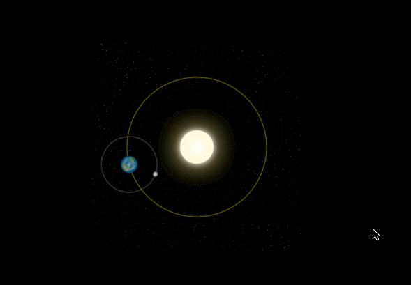
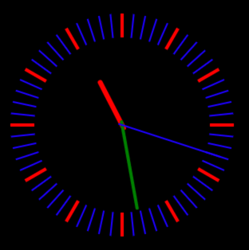

# [0056. canvas 在线学习 - 菜鸟教程](https://github.com/tnotesjs/TNotes.canvas/tree/main/notes/0056.%20canvas%20%E5%9C%A8%E7%BA%BF%E5%AD%A6%E4%B9%A0%20-%20%E8%8F%9C%E9%B8%9F%E6%95%99%E7%A8%8B)

<!-- region:toc -->

- [1. 评价](#1-评价)
- [2. 在“菜鸟教程”上搜索 canvas](#2-在菜鸟教程上搜索-canvas)
- [3. 引用](#3-引用)

<!-- endregion:toc -->

## 1. 评价

- 该笔记记录了菜鸟教程上 canvas 相关的教程链接。
- 菜鸟教程上 canvas 相关的资料相对来说是比较零散的，跟 H5 合并起来介绍了，H5 讲一些，然后 canvas 讲一些，阅读起来会比较跳跃。

## 2. 在“菜鸟教程”上搜索 canvas

- https://www.runoob.com/?s=canvas
- 

## 3. 引用

- [文章：学习 HTML5 Canvas 这一篇文章就够了][1]
  - 篇幅比较长，不过讲解得也算是比较全面的，适合作为快速入门阅读。
  - 结尾有俩案例，可以重点看看。
    - 一个是“太阳系”的效果
      - 
    - 一个是“时钟”的效果
      - 
- [文章：HTML5 Canvas][2]
- [文章：HTML5 `<canvas>` 参考手册][3]

[1]: https://www.runoob.com/w3cnote/html5-canvas-intro.html
[2]: https://www.runoob.com/html/html5-canvas.html
[3]: https://www.runoob.com/tags/ref-canvas.html
